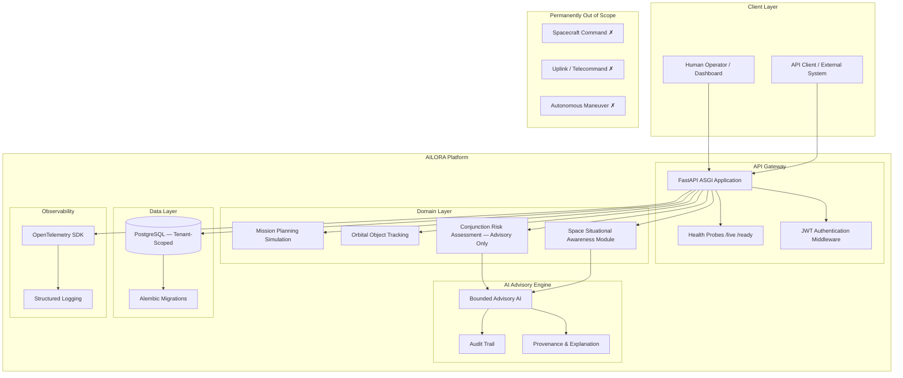

<div align="center">

# AILORA

### An Azimi Innovation Lab Orbital Intelligence System

*Intelligence Beyond the Horizon*

---


**AILORA is a space decision-support, analysis, and simulation platform providing integrated
situational awareness of Earth-orbit objects and activities.** It supports human decision-making
through governed evidence, explainable analysis, and bounded risk assessment — operating on
Physics-First and AI-Advisory-Only principles.

> ⚠️ **Advisory-Only Statement:** All AI outputs produced by AILORA are strictly advisory.
> The platform makes no autonomous operational decisions and maintains a **permanent prohibition**
> on any spacecraft command, telecommand, uplink, or autonomous maneuver execution path.
> This prohibition is absolute and applies under all conditions, modes, and extensions.

</div>

---

## Official Demo

> **Coming soon — To be added after official approval by Amin Azimi.**
>
> A reproducible demo scenario demonstrating end-to-end conjunction risk assessment
> and advisory recommendation will be published here upon completion of the
> Verified Space Vertical Slice (PHASE_3).

---

## Table of Contents

1. [Why AILORA](#why-ailora)
2. [Capabilities](#capabilities)
3. [Architecture](#architecture)
4. [Technology Stack](#technology-stack)
5. [Quick Start](#quick-start)
6. [API Reference](#api-reference)
7. [Testing & Quality](#testing--quality)
8. [Safety & Scientific Integrity](#safety--scientific-integrity)
9. [Roadmap](#roadmap)
10. [Project Timeline](#project-timeline)
11. [Documentation Index](#documentation-index)
12. [Project Links Hub](#project-links-hub)
13. [Author](#author)

---

## Why AILORA

Earth's orbital environment is increasingly congested. Thousands of active satellites and
hundreds of thousands of debris objects create a growing risk of collision that demands
continuous monitoring, accurate risk assessment, and rapid human decision-making.

Existing tools are often closed, single-purpose, or lack the architectural rigour needed
for enterprise-grade integration. AILORA addresses this gap by providing:

| Principle | Meaning |
|---|---|
| **Physics-First** | All risk calculations are grounded in established orbital mechanics — no unverified heuristics |
| **AI-Advisory-Only** | AI outputs are recommendations to human operators, never autonomous decisions |
| **Evidence-Based** | Every output carries data provenance, uncertainty bounds, and audit trail |
| **Explainability** | Risk levels and recommendations include human-readable explanations |
| **Bounded Scope** | The platform operates within clearly defined, auditable capability boundaries |

AILORA targets **LEO · MEO · GEO · HEO** orbital regimes and delivers integrated
situational awareness as a Challenge-ready Enterprise SaaS Foundation.

---

## Capabilities

### ✅ Implemented

| Capability | Description | Tests | Status |
|---|---|---|---|
| Health endpoints | `/health/live` and `/health/ready` liveness and readiness probes | `test_health.py` | Verified |
| FastAPI application scaffold | Full ASGI application with structured routing | `test_health.py` | Verified |
| Configuration management | Pydantic-settings environment-based config | — | Verified |
| Engineering baseline | `pyproject.toml`, ruff, mypy, pytest, uv toolchain | — | Verified |
| README documentation contract | Flagship README with 35 contract tests | `test_readme.py` | Verified |
| Docker containerisation | Multi-stage Dockerfile and docker-compose scaffold | `test_docker_contracts.py` | Verified |
| Verification baseline | `docs/verification.md` quality-gate evidence skeleton | — | Verified |

### 🔄 In Progress

*No capabilities currently in progress — PHASE_0 complete.*

### 📋 Planned

| Capability | Description | Phase |
|---|---|---|
| Database connection + Alembic migrations | PostgreSQL integration | PHASE_1 |
| Identity, membership, tenancy | JWT auth, tenant-scoped access, isolation tests | PHASE_2 |
| Conjunction risk assessment (Advisory) | T0/PHY-C1/C2 screening | PHASE_3 |
| TLE / state vector parsing | Synthetic orbital data ingestion | PHASE_3 |

> C-10 adds advisory SGP4 propagation with native TEME outputs. Frame conversion and independent scientific approval remain explicit future gates.
>
> C-11 adds bounded advisory TCA search, explicit TEME covariance health contracts, and
> conservative uncertainty labels. It does not compute collision probability, transform frames
> or covariance, recommend maneuvers, or claim independent scientific approval.
>
> C-12 adds a fail-closed differential-verification contract for provenance-bound independent
> references and explicit conflict states. It does not self-issue scientific approval or install
> a second engine; qualified independent review remains an external gate.
| Explainable advisory recommendations | Human-readable risk output with provenance | PHASE_3 |
| OpenTelemetry observability | Structured logging and tracing | PHASE_1 |
| GitHub Actions CI | Lint, type-check, test on every push | PHASE_1 |

### 🔴 Blocked

| Capability | Reason | Resolution |
|---|---|---|
| Normative conjunction-risk algorithms | Prompt 06 `DOMAIN_REVIEW_REQUIRED` — independent qualified Astrodynamics review required | See [Safety & Scientific Integrity](#safety--scientific-integrity) |
| Real TLE data integration (NASA/CelesTrak) | Dependency on data access agreements | Future roadmap item with acceptance criteria |

> C-09 provides a disabled-by-default, transport-injected provider boundary. Live access remains unqualified and blocked pending source-specific legal/data-governance evidence.

---

## Architecture

The AILORA platform is structured as layered vertical concerns, each with defined
interfaces, data standards, and governance contracts.



**Platform scope:** `EARTH_ORBIT_ONLY` — Active regimes: LEO · MEO · GEO · HEO

**Tenancy model:** `shared_database_with_tenant_key` (Prompt 15 §12 default)

---

## Technology Stack

> Only packages present in [`pyproject.toml`](pyproject.toml) and approved from the Prompt 01 candidate stack.

| Layer | Technology | Version |
|---|---|---|
| **Runtime** | Python | ≥ 3.11 |
| **Web Framework** | FastAPI | ≥ 0.115 |
| **ASGI Server** | Uvicorn (standard) | ≥ 0.32 |
| **Data Validation** | Pydantic v2 | ≥ 2.9 |
| **Configuration** | pydantic-settings | ≥ 2.6 |
| **ORM** | SQLAlchemy | ≥ 2.0 |
| **Migrations** | Alembic | ≥ 1.14 |
| **Database** | PostgreSQL | 16 (docker-compose) |
| **DB Driver** | psycopg (v3) | ≥ 3.2 |
| **Authentication** | python-jose + passlib (bcrypt) | ≥ 3.3 / ≥ 1.7 |
| **HTTP Client** | httpx | ≥ 0.28 |
| **Structured Logging** | structlog | ≥ 24.4 |
| **Observability** | OpenTelemetry SDK + FastAPI instrumentation | ≥ 1.28 |
| **Packaging / Env** | uv | current |
| **Linting / Formatting** | ruff | ≥ 0.8 |
| **Type Checking** | mypy (strict) | ≥ 1.13 |
| **Testing** | pytest + pytest-asyncio + pytest-cov | ≥ 8.3 |
| **Build Backend** | hatchling | current |

---

## Quick Start

**Prerequisites:** Python 3.11+, [uv](https://github.com/astral-sh/uv), Docker (optional)

```bash
# 1. Clone the repository
git clone <repository-url> ailora
cd ailora

# 2. Install dependencies (uv resolves and creates .venv automatically)
export PATH="$HOME/Library/Python/3.9/bin:$PATH"   # adjust if uv is on PATH already
uv sync

# 3. Copy environment template
cp .env.example .env

# 4. Run the quality suite (lint, type-check, tests)
uv run ruff format --check src/ tests/
uv run ruff check src/ tests/
uv run mypy src/
uv run pytest tests/ -v

# 5. Start the development server
uv run uvicorn ailora.api.app:app --reload --host 0.0.0.0 --port 8000

# — or use the Makefile shortcuts —
make lint
make test
make run
```

> **Docker Quick Start** (requires Dockerfile — see [Roadmap](#roadmap) for current P0-07 status):
>
> ```bash
> docker build . -t ailora:dev
> docker compose up
> ```

---

## API Reference

> A running server is required to access the interactive API documentation.
> Start the server with `uv run uvicorn ailora.api.app:app --reload` then open:

| Endpoint | Description |
|---|---|
| `GET /health/live` | Liveness probe — confirms process is alive |
| `GET /health/ready` | Readiness probe — confirms service is ready to handle traffic |
| `/docs` | Swagger UI (interactive API explorer) |
| `/redoc` | ReDoc UI (documentation-focused view) |
| `/openapi.json` | Raw OpenAPI 3 schema |

---

## Testing & Quality

### Running the Test Suite

```bash
export PATH="$HOME/Library/Python/3.9/bin:$PATH"

# Full suite with coverage
uv run pytest tests/ -v

# No coverage (faster)
uv run pytest tests/ -v --no-cov

# Specific test module
uv run pytest tests/test_health.py -v --no-cov
uv run pytest tests/test_readme.py -v --no-cov
```

### Quality Gates

```bash
# Format check
uv run ruff format --check src/ tests/

# Lint
uv run ruff check src/ tests/

# Type check (strict)
uv run mypy src/

# All via Makefile
make lint && make test
```

### Current Results (Gate 8 baseline)

```
ruff format --check   ✅  11 files, all formatted
ruff check            ✅  0 issues (7 source files)
mypy (strict)         ✅  0 issues (7 source files, strict mode)
pytest                ✅  51 tests collected, 51 passed
  tests/test_health.py          —  2 tests (liveness, readiness)
  tests/test_readme.py          — 35 tests (documentation contract)
  tests/test_docker_contracts.py — 14 tests (Dockerfile/docker-compose contracts)
```

---

## Safety & Scientific Integrity

### Advisory-Only Boundary (Permanent)

All AI and analytical outputs produced by AILORA are **strictly advisory**. The platform
supports human decision-making — it does not replace it. No output from AILORA constitutes
an operational command, clearance, or normative recommendation for spacecraft operations.

### Permanently Prohibited — No Exceptions

The following capabilities are **not "not yet implemented"** — they are permanently out of
scope under all conditions, modes, and extensions (`E9 / APR-X / INC-0 / HARD_DENY`):

- **Spacecraft Command**
- **Telecommand**
- **Uplink**
- **Flight Control Execution**
- **Autonomous Maneuver Execution**

### Prompt 06 Domain Review Status

```
PROMPT_06_DOMAIN_REVIEW = PARTIAL / STILL OPEN
SENTINEL                = DOMAIN_REVIEW_REQUIRED — NOT_NORMATIVELY_ACTIVATED
SOURCE                  = CSIP-EO-RS-STAGE-20 / 0.1.0-reconstituted-draft
```

Prompt 06 (`CSIP-EO-RS-STAGE-20`) carries a standing `DOMAIN_REVIEW_REQUIRED` sentinel.
The Astrodynamics and scientific-algorithm contracts defined in Prompt 06 have **not**
received the independent qualified scientific review required to achieve Normative or
Operational status.

**Effect on the project:**

- All conjunction-risk and collision-probability outputs are presented as **Advisory,
  Bounded, and non-Normative** until this review is completed.
- No scientific output may be labelled Normative, Qualified, or Operationally Authoritative.
- This gate is **non-blocking** for identity and foundation development, but **blocking**
  for any Normative scientific claim.

### Oya — Future Direction

> **Status: PLANNED / NOT CURRENTLY IMPLEMENTED**

Oya is planned for a future stage of AILORA's evolution.  The service is
intentionally kept disabled during the prototype phase.  A safe placeholder
module exists in `src/ailora/services/oya/` with a no-op adapter and
fail-closed configuration.  No real Oya API call, vendor charge, or paid
service activation occurs in prototype, development, test, or challenge phases.
All production activation requires explicit authorization from Amin Azimi and
the production revenue gate being met.

See [Future Integration Roadmap: Oya Voice AI](#future-integration-roadmap-oya-voice-ai)
for the full architecture and activation requirements.

---

## Roadmap

> Roadmap reflects development intent, not committed delivery dates or completed work.
> Phases are evidence-based and subject to adjustment. No invented dates are included.

| Phase | Objective | Exit Condition | Status |
|---|---|---|---|
| **PHASE_0** — Discovery & Baseline | Establish evidence-based baseline: repo, scope, constraints, risks | Repository, tooling, identity docs, scaffold operational | ✅ Complete |
| **PHASE_1** — Foundation | Minimal healthy architecture and engineering baseline | Build, test, and core boundaries operational | ✅ Complete |
| **PHASE_2** — Identity & Tenancy | Identity, membership, policy, and tenant isolation | Authorized tenant-scoped access verified | ✅ Complete |
| **PHASE_3** — Vertical Slice | One real end-to-end use case (conjunction risk advisory) | Slice implemented, tested, and evidenced | ✅ Complete |
| **PHASE_4** — Workflow & Events | Durable jobs, state transitions, event handling | Idempotency, retry, and failure behavior verified | 📋 Planned |
| **PHASE_5** — AI Advisory | Bounded advisory AI capability | Safety, provenance, validation, and cost controls verified | 📋 Planned |
| **PHASE_6** — Hardening | Security, reliability, performance, observability | Defined readiness criteria have evidence | 📋 Planned |
| **PHASE_7** — Release Candidate | Reviewable release candidate | Explicit Release Gate decision is possible | 📋 Planned |

> Source: Prompt 15 §29 (CSIP-EO-FMSP-P15 v1.1.0)

---

## Project Timeline

| Event | Date |
|---|---|
| **Official Project Start** | 2026-08-05 |
| **Official Project End** | NOT_YET_COMPLETED |

---

## Documentation Index

| Document | Location | Description |
|---|---|---|
| Prompt Sequence (CSIP-EO-FMSP) | [`docs/prompt-sequence/`](docs/prompt-sequence/) | Authoritative 15-part governing specification |
| Prompt 01 — Architecture | [`docs/prompt-sequence/prompt-01.md`](docs/prompt-sequence/prompt-01.md) | Platform architecture and stack baseline |
| Prompt 06 — Scientific Truth | [`docs/prompt-sequence/prompt-06.md`](docs/prompt-sequence/prompt-06.md) | Astrodynamics contracts (DOMAIN_REVIEW_REQUIRED) |
| Prompt 15 — Development Contract | [`docs/prompt-sequence/prompt-15.md`](docs/prompt-sequence/prompt-15.md) | Execution, lifecycle, and gate contracts |
| Development Ledger | [`DEVLOG.md`](DEVLOG.md) | Commit-by-commit development log and decisions |
| Environment Template | [`.env.example`](.env.example) | Local development configuration template |
| Application Entry Point | [`src/ailora/main.py`](src/ailora/main.py) | AILORA application main module |
| API Application | [`src/ailora/api/app.py`](src/ailora/api/app.py) | FastAPI application factory |
| Health Router | [`src/ailora/api/routers/health.py`](src/ailora/api/routers/health.py) | Liveness and readiness probe endpoints |
| Health Tests | [`tests/test_health.py`](tests/test_health.py) | Health endpoint contract tests |
| README Contract Tests | [`tests/test_readme.py`](tests/test_readme.py) | Documentation truthfulness contract tests |
| Verification Baseline | [`docs/verification.md`](docs/verification.md) | Quality-gate evidence records by phase |

---

## Project Links Hub

> Canonical location for all project URLs and resource references.
> Resources marked **[placeholder]** are not yet deployed and will be updated
> upon official approval by Amin Azimi.

| Resource | URL / Location | Status |
|---|---|---|
| Repository (local) | `/Users/amin/Documents/bob-space-project-intake-2026` | Active |
| Remote Repository | To be provided by Amin Azimi | **[placeholder]** |
| CI/CD Pipeline | To be configured (GitHub Actions — PHASE_1) | **[placeholder]** |
| Deployed API | Not yet deployed — no production environment exists | **[placeholder]** |
| API Documentation (`/docs`) | `http://localhost:8000/docs` (local dev only) | Local only |
| API Documentation (`/redoc`) | `http://localhost:8000/redoc` (local dev only) | Local only |
| Container Image (local) | `ailora:dev` (built via `docker build . -t ailora:dev`) | Local only |
| Container Registry | To be provided by Amin Azimi | **[placeholder]** |
| Project Website | To be provided by Amin Azimi | **[placeholder]** |
| Demo Environment | To be added after official approval by Amin Azimi | **[placeholder]** |

---


## Future Integration Roadmap: Oya Voice AI

> **Status: PLANNED / NOT CURRENTLY IMPLEMENTED as a production service — PROTOTYPE PHASE — DISABLED / MOCKED / NON-BILLABLE**

Oya is integrated into the core architecture as a future enhancement and is intentionally kept disabled during the prototype phase to optimize initial operational overhead.

No Oya API call, vendor charge, or paid service activation occurs in prototype, development, test, or challenge environments.

### Prototype vs Production Phases

| Dimension | Prototype Phase (current) | Production Phase (future) |
|---|---|---|
| **Service state** | Disabled / no-op adapter | Active after revenue gate |
| **Network calls** | None — fail-closed | Real vendor API calls |
| **Cost** | Zero — non-billable | Pay-per-use (vendor TBD) |
| **API key** | Empty placeholder | Production credential required |
| **Activation** | Not authorized | Requires explicit authorization |
| **Fallback** | Always TEXT_CHAT | TEXT_CHAT on failure |
| **Code module** | `src/ailora/services/oya/` | Same module, production adapter |

### Feature / Use-Case Matrix

| Capability | Prototype | Production | Notes |
|---|---|---|---|
| Low-latency real-time voice conversation | ✗ Disabled | ✓ Planned | Vendor TBD |
| Multilingual conversations + language switching | ✗ Disabled | ✓ Planned | BCP-47 language tags |
| Dynamic accent and emotion adaptation | ✗ Disabled | ✓ Planned | Provider-neutral interface |
| Voice-driven workflow and tool execution | ✗ Disabled | ✓ Planned | Requires authorization boundary |
| Sentiment and user-context adaptation | ✗ Disabled | ✓ Planned | Advisory-only output |
| Voice onboarding flows | ✗ Disabled | ✓ Planned | Tenant-scoped |
| Real-time customer assistance | ✗ Disabled | ✓ Planned | Human-in-the-loop |
| Hands-free orbital advisory commands | ✗ Disabled | ✓ Planned | Advisory-only; no spacecraft commands |
| Interactive audio-guided analysis | ✗ Disabled | ✓ Planned | Space advisory context |
| Web / Mobile / Embedded integration | ✗ Disabled | ✓ Planned | Modular adapter pattern |

### Activation Criteria (Production Gate)

All of the following must be true simultaneously:

1. `AILORA_ENABLE_OYA_VOICE_SERVICE=true` — explicit feature flag
2. `AILORA_OYA_API_KEY` — non-empty production credential (server-side only)
3. `AILORA_OYA_ENVIRONMENT=production` — environment gate
4. Explicit authorization from Amin Azimi
5. Active revenue generation (production commercial operation)

**Fail-closed**: If any condition is missing or invalid, the service remains disabled and falls back to TEXT_CHAT.

### Architecture Boundaries

```
[User / Operator]
       │
       ▼
[AILORA API Gateway] ──── Authorization ──── [JWT + Membership check]
       │
       ▼
[OyaVoiceAdapter interface]   ← Provider-neutral contract
       │
       ├── [NoOpOyaAdapter]        ← PROTOTYPE PHASE (current) — no network calls
       │
       └── [ProductionOyaAdapter]  ← PRODUCTION PHASE (future) — vendor SDK (TBD)
                                       Never activated in prototype
```

- Secrets remain server-side; never exposed to clients, logs, or source control.
- Tenant context is required for all voice sessions.
- Session quota, timeout, and circuit-breaker limits are defined in `OyaSettings`.
- All voice advisory outputs remain advisory-only; no spacecraft command path exists.

### Security and Privacy Considerations

| Concern | Mitigation |
|---|---|
| **Secret exposure** | API key and webhook secret in environment only; never in code/logs |
| **Prompt injection** | Voice inputs must be validated before tool execution |
| **Sensitive audio** | Raw audio and transcripts are not retained beyond session scope |
| **Tenant isolation** | Each session scoped to a verified tenant membership |
| **Unauthorized tool execution** | Explicit user confirmation required for sensitive actions |
| **Replay attacks** | Webhook signature verification (TBD — vendor-specific) |
| **Quota abuse** | Per-tenant rate limits and session budgets enforced in config |
| **Fallback security** | TEXT_CHAT fallback preserves all authorization controls |

### Operational Risks

| Risk | Status | Mitigation |
|---|---|---|
| Accidental paid activation | Mitigated by fail-closed config | Three-gate activation requirement |
| Voice latency degradation | Not yet measured | Circuit-breaker and timeout controls planned |
| Provider unavailability | Handled by no-op fallback | TEXT_CHAT fallback always available |
| Audio data residency | TBD — vendor-specific | Data residency requirements to be assessed |
| Cost overrun | Bounded by session limits | Per-tenant quotas in `OyaSettings` |

### Rollout Stages (Future)

1. **Alpha** — Internal synthetic testing with no real users
2. **Beta** — Selected tenants with explicit consent and monitored cost
3. **GA** — Full production rollout after Beta validation

### Observability

Telemetry records for each Oya session must include:

- Session health and state transitions
- Latency and timeout events
- Quota and cost signals (no raw audio or transcript)
- Fallback events and reason codes
- Error categories (no sensitive stack traces to clients)

**Never recorded**: raw audio, transcripts, API keys, or user PII beyond session ID.

### Fallback Behavior

When voice quota, provider availability, or latency limits fail:
- Fall back to standard text chat immediately.
- Preserve tenant context and user session.
- Log a telemetry fallback event (no sensitive data).
- Return `OyaSessionState.DEGRADED` with `fallback_applied=True`.

### Cost Controls

- `AILORA_OYA_MAX_SESSIONS_PER_TENANT` — hard session concurrency limit
- `AILORA_OYA_MAX_AUDIO_DURATION_SECONDS` — maximum audio per session
- `AILORA_OYA_SESSION_TIMEOUT_SECONDS` — session idle timeout
- No unbounded retry loops
- Budget alerts and hard limits required before production activation

> ⚠️ **Vendor-specific details** (SDK methods, pricing, compliance certifications,
> performance figures, and authentication URLs) are marked **TBD** until vendor
> documentation and data-access agreements are confirmed.  This blueprint is
> intentionally provider-adaptable.

---


## Author

| Field | Value |
|---|---|
| **Author** | Amin Azimi |
| **Title** | AI Architect |
| **Responsibility** | End-to-End System Architecture and Project Development |
| **Organization** | Azimi Innovation Lab |
| **Portrait** | To be provided by Amin Azimi |
| **Contact / Profile Links** | To be provided by Amin Azimi |

> *All profile links, portraits, and external references are placeholders and will be
> added after explicit authorization from Amin Azimi.*

---

<div align="center">

*AILORA — An Azimi Innovation Lab Orbital Intelligence System*

*Intelligence Beyond the Horizon*

*© Azimi Innovation Lab — All rights reserved*

</div>
