<div align="center">

# AILORA

<!-- AILORA_CINEMATIC_EXPERIENCE_BEGIN -->

<p align="center">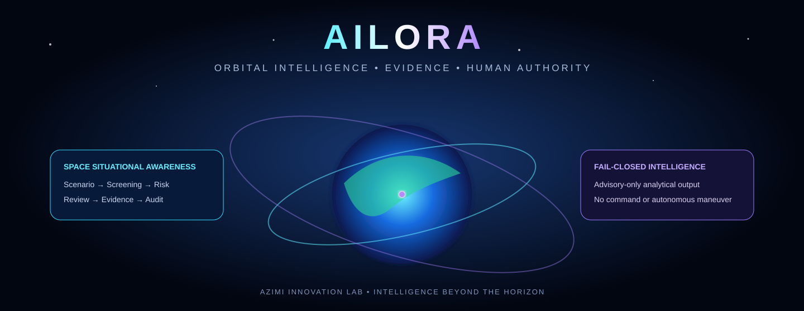</p>

<p align="center"><a href="https://ailora-web.onrender.com/health/live">Live Service</a> • <a href="https://ailora-web.onrender.com/docs">Interactive API</a> • <a href="#architecture">Architecture</a> • <a href="#bob-engineering-agent">Bob Agent</a> • <a href="#safety--scientific-integrity">Safety</a></p>

> **Live prototype:** the Render service is operational. Analytical outputs remain advisory-only. NASA live data is **NOT ACTIVATED**. The Oya voice service is **PLANNED**, **NOT CURRENTLY IMPLEMENTED**, and **DISABLED**.

<!-- AILORA_CINEMATIC_EXPERIENCE_END -->


### An Azimi Innovation Lab Orbital Intelligence System

*Intelligence Beyond the Horizon*

---


**AILORA is a space decision-support, analysis, and simulation platform providing integrated
situational awareness of Earth-orbit objects and activities.** It supports human decision-making
through governed evidence, explainable analysis, and bounded risk assessment — operating on
Physics-First and AI-Advisory-Only principles.

> ⚠️ **Advisory-Only Statement:** All AI outputs produced by AILORA are strictly advisory.
> The platform makes no autonomous operational decisions and maintains a **permanent prohibition**
> on any spacecraft command, telecommand, uplink, or autonomous maneuver execution path.
> This prohibition is absolute and applies under all conditions, modes, and extensions.

</div>

---

## Official Demo

<!-- AILORA_CINEMATIC_V2_DEMO -->

### 30-Second Swagger Demo

<p align="center">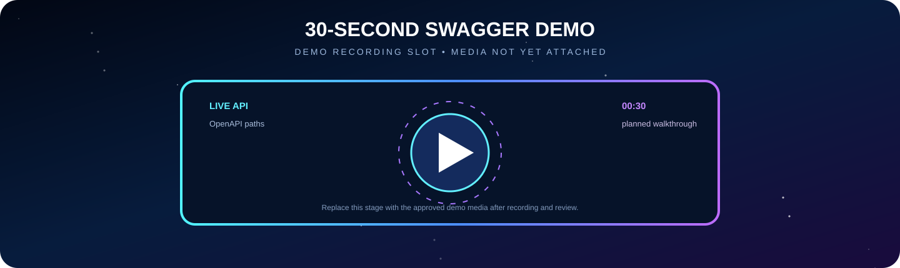</p>

> **DEMO RECORDING SLOT:** reserved for an approved 30-second Swagger walkthrough. No recording is attached yet. The live API remains available at [Swagger UI](https://ailora-web.onrender.com/docs).


> **Coming soon — To be added after official approval by Amin Azimi.**
>
> A reproducible demo scenario demonstrating end-to-end conjunction risk assessment
> and advisory recommendation will be published here upon completion of the
> Verified Space Vertical Slice (PHASE_3).

---

## Mission Control Snapshot

| Control-plane signal | Verified state |
|---|---|
| **Live API** | [`ailora-web.onrender.com`](https://ailora-web.onrender.com) |
| **Liveness** | [`/health/live`](https://ailora-web.onrender.com/health/live) |
| **Interactive OpenAPI** | [`/docs`](https://ailora-web.onrender.com/docs) |
| **API surface** | 18 OpenAPI paths |
| **Automated verification** | 644 tests passing |
| **Statement coverage** | 87.77% against an enforced 85% floor |
| **Deployment model** | Render-hosted terrestrial prototype |
| **NASA live data** | **NOT ACTIVATED** — qualification remains gated |
| **Oya voice service** | **DISABLED** — no-op, network-free and non-billable |
| **Human authority** | **REQUIRED** — AI output remains advisory |
| **Spacecraft commands** | **PERMANENTLY PROHIBITED** |

---

<!-- AILORA_CINEMATIC_V2_GALLERY -->

## Project Visual Gallery

<p align="center">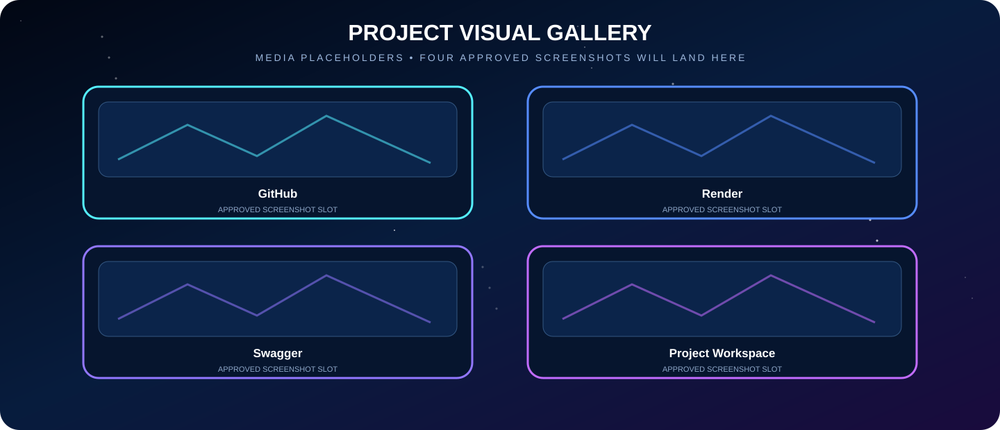</p>

**MEDIA PLACEHOLDERS:** four approved screenshots will replace these frames after final capture and privacy review: **GitHub**, **Render**, **Swagger**, and **Project Workspace**. Placeholder graphics are presentation scaffolding, not evidence of production authorization.

---

## Table of Contents

1. [Why AILORA](#why-ailora)
2. [Capabilities](#capabilities)
3. [Architecture](#architecture)
4. [Technology Stack](#technology-stack)
5. [Quick Start](#quick-start)
6. [API Reference](#api-reference)
7. [Testing & Quality](#testing--quality)
8. [Safety & Scientific Integrity](#safety--scientific-integrity)
9. [Roadmap](#roadmap)
10. [Project Timeline](#project-timeline)
11. [Documentation Index](#documentation-index)
12. [Project Links Hub](#project-links-hub)
13. [Author](#author)

---

<!-- AILORA_CINEMATIC_V2_CONNECTED_WORLDS -->

## Connected Worlds

<p align="center">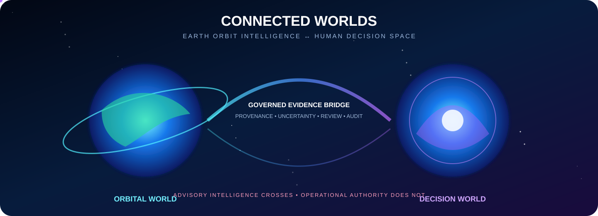</p>

AILORA connects the orbital world to the human decision world through a governed evidence bridge. Provenance, uncertainty, review state and audit context may cross that bridge; operational spacecraft authority never does.

---

## Why AILORA

Earth's orbital environment is increasingly congested. Thousands of active satellites and
hundreds of thousands of debris objects create a growing risk of collision that demands
continuous monitoring, accurate risk assessment, and rapid human decision-making.

Existing tools are often closed, single-purpose, or lack the architectural rigour needed
for enterprise-grade integration. AILORA addresses this gap by providing:

| Principle | Meaning |
|---|---|
| **Physics-First** | All risk calculations are grounded in established orbital mechanics — no unverified heuristics |
| **AI-Advisory-Only** | AI outputs are recommendations to human operators, never autonomous decisions |
| **Evidence-Based** | Every output carries data provenance, uncertainty bounds, and audit trail |
| **Explainability** | Risk levels and recommendations include human-readable explanations |
| **Bounded Scope** | The platform operates within clearly defined, auditable capability boundaries |

AILORA targets **LEO · MEO · GEO · HEO** orbital regimes and delivers integrated
situational awareness as a Challenge-ready Enterprise SaaS Foundation.

---

<!-- AILORA_CINEMATIC_V2_EVIDENCE -->

## Evidence Constellation

<p align="center">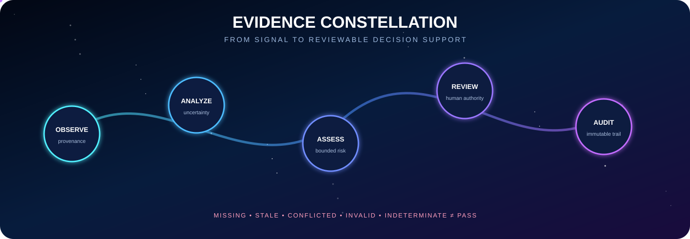</p>

The visual sequence presents the system as one continuous mission narrative: **Observe → Analyze → Assess → Review → Audit**. Dense verification tables remain below as inspectable evidence, while this layer communicates the architecture at a glance.

---

## Capabilities

### ✅ Implemented

| Capability | Description | Tests | Status |
|---|---|---|---|
| Health endpoints | `/health/live` and `/health/ready` liveness and readiness probes | `test_health.py` | Verified |
| FastAPI application scaffold | Full ASGI application with structured routing | `test_health.py` | Verified |
| Configuration management | Pydantic-settings environment-based config | — | Verified |
| Engineering baseline | `pyproject.toml`, ruff, mypy, pytest, uv toolchain | — | Verified |
| README documentation contract | Flagship README with 35 contract tests | `test_readme.py` | Verified |
| Docker containerisation | Multi-stage Dockerfile and docker-compose scaffold | `test_docker_contracts.py` | Verified |
| Verification baseline | `docs/verification.md` quality-gate evidence skeleton | — | Verified |

### 🔄 In Progress

*No capabilities currently in progress — PHASE_0 complete.*

### 📋 Planned

| Capability | Description | Phase |
|---|---|---|
| Database connection + Alembic migrations | PostgreSQL integration | PHASE_1 |
| Identity, membership, tenancy | JWT auth, tenant-scoped access, isolation tests | PHASE_2 |
| Conjunction risk assessment (Advisory) | T0/PHY-C1/C2 screening | PHASE_3 |
| TLE / state vector parsing | Synthetic orbital data ingestion | PHASE_3 |

> C-10 adds advisory SGP4 propagation with native TEME outputs. Frame conversion and independent scientific approval remain explicit future gates.
>
> C-11 adds bounded advisory TCA search, explicit TEME covariance health contracts, and
> conservative uncertainty labels. It does not compute collision probability, transform frames
> or covariance, recommend maneuvers, or claim independent scientific approval.
>
> C-12 adds a fail-closed differential-verification contract for provenance-bound independent
> references and explicit conflict states. It does not self-issue scientific approval or install
> a second engine; qualified independent review remains an external gate.
| Explainable advisory recommendations | Human-readable risk output with provenance | PHASE_3 |
| OpenTelemetry observability | Structured logging and tracing | PHASE_1 |
| GitHub Actions CI | Lint, type-check, test on every push | PHASE_1 |

### 🔴 Blocked

| Capability | Reason | Resolution |
|---|---|---|
| Normative conjunction-risk algorithms | Prompt 06 `DOMAIN_REVIEW_REQUIRED` — independent qualified Astrodynamics review required | See [Safety & Scientific Integrity](#safety--scientific-integrity) |
| Real TLE data integration (NASA/CelesTrak) | Dependency on data access agreements | Future roadmap item with acceptance criteria |

> C-09 provides a disabled-by-default, transport-injected provider boundary. Live access remains unqualified and blocked pending source-specific legal/data-governance evidence.

---

## Cinematic System Journey

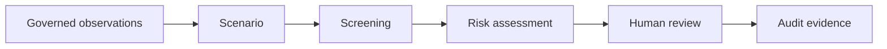

AILORA treats every analytical journey as a governed evidence chain. Inputs are tenant-scoped, transformations are traceable, uncertainty remains visible, and recommendations cannot silently become operational authority.

| Journey layer | Responsibility | Safety boundary |
|---|---|---|
| **Observe** | Admit typed, provenance-bearing observations | Invalid data never becomes trusted evidence |
| **Analyze** | Build scenarios, screenings and risk assessments | Results remain advisory and uncertainty-aware |
| **Review** | Present evidence to an authenticated human | Review does not create spacecraft command authority |
| **Record** | Persist append-only audit and workflow evidence | Historical evidence is preserved |
| **Recover** | Replay durable workflows and transitions | Failure degrades safely and remains observable |

---

## Architecture

The AILORA platform is structured as layered vertical concerns, each with defined
interfaces, data standards, and governance contracts.

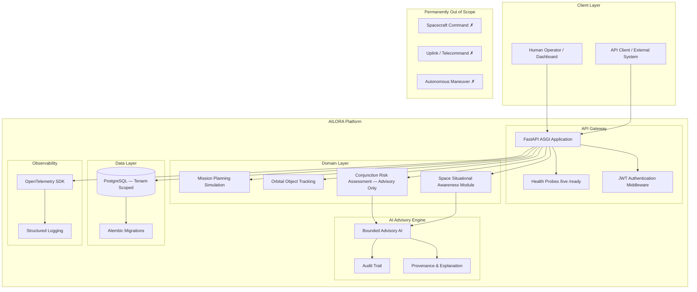

**Platform scope:** `EARTH_ORBIT_ONLY` — Active regimes: LEO · MEO · GEO · HEO

**Tenancy model:** `shared_database_with_tenant_key` (Prompt 15 §12 default)

---

## Technology Stack

> Only packages present in [`pyproject.toml`](pyproject.toml) and approved from the Prompt 01 candidate stack.

| Layer | Technology | Version |
|---|---|---|
| **Runtime** | Python | ≥ 3.11 |
| **Web Framework** | FastAPI | ≥ 0.115 |
| **ASGI Server** | Uvicorn (standard) | ≥ 0.32 |
| **Data Validation** | Pydantic v2 | ≥ 2.9 |
| **Configuration** | pydantic-settings | ≥ 2.6 |
| **ORM** | SQLAlchemy | ≥ 2.0 |
| **Migrations** | Alembic | ≥ 1.14 |
| **Database** | PostgreSQL | 16 (docker-compose) |
| **DB Driver** | psycopg (v3) | ≥ 3.2 |
| **Authentication** | python-jose + passlib (bcrypt) | ≥ 3.3 / ≥ 1.7 |
| **HTTP Client** | httpx | ≥ 0.28 |
| **Structured Logging** | structlog | ≥ 24.4 |
| **Observability** | OpenTelemetry SDK + FastAPI instrumentation | ≥ 1.28 |
| **Packaging / Env** | uv | current |
| **Linting / Formatting** | ruff | ≥ 0.8 |
| **Type Checking** | mypy (strict) | ≥ 1.13 |
| **Testing** | pytest + pytest-asyncio + pytest-cov | ≥ 8.3 |
| **Build Backend** | hatchling | current |

---

## Quick Start

**Prerequisites:** Python 3.11+, [uv](https://github.com/astral-sh/uv), Docker (optional)

```bash
# 1. Clone the repository
git clone <repository-url> ailora
cd ailora

# 2. Install dependencies (uv resolves and creates .venv automatically)
export PATH="$HOME/Library/Python/3.9/bin:$PATH"   # adjust if uv is on PATH already
uv sync

# 3. Copy environment template
cp .env.example .env

# 4. Run the quality suite (lint, type-check, tests)
uv run ruff format --check src/ tests/
uv run ruff check src/ tests/
uv run mypy src/
uv run pytest tests/ -v

# 5. Start the development server
uv run uvicorn ailora.api.app:app --reload --host 0.0.0.0 --port 8000

# — or use the Makefile shortcuts —
make lint
make test
make run
```

> **Docker Quick Start** (requires Dockerfile — see [Roadmap](#roadmap) for current P0-07 status):
>
> ```bash
> docker build . -t ailora:dev
> docker compose up
> ```

---

## API Reference

> A running server is required to access the interactive API documentation.
> Start the server with `uv run uvicorn ailora.api.app:app --reload` then open:

| Endpoint | Description |
|---|---|
| `GET /health/live` | Liveness probe — confirms process is alive |
| `GET /health/ready` | Readiness probe — confirms service is ready to handle traffic |
| `/docs` | Swagger UI (interactive API explorer) |
| `/redoc` | ReDoc UI (documentation-focused view) |
| `/openapi.json` | Raw OpenAPI 3 schema |

---

## Testing & Quality

### Running the Test Suite

```bash
export PATH="$HOME/Library/Python/3.9/bin:$PATH"

# Full suite with coverage
uv run pytest tests/ -v

# No coverage (faster)
uv run pytest tests/ -v --no-cov

# Specific test module
uv run pytest tests/test_health.py -v --no-cov
uv run pytest tests/test_readme.py -v --no-cov
```

### Quality Gates

```bash
# Format check
uv run ruff format --check src/ tests/

# Lint
uv run ruff check src/ tests/

# Type check (strict)
uv run mypy src/

# All via Makefile
make lint && make test
```

### Current Results (Gate 8 baseline)

```
ruff format --check   ✅  11 files, all formatted
ruff check            ✅  0 issues (7 source files)
mypy (strict)         ✅  0 issues (7 source files, strict mode)
pytest                ✅  51 tests collected, 51 passed
  tests/test_health.py          —  2 tests (liveness, readiness)
  tests/test_readme.py          — 35 tests (documentation contract)
  tests/test_docker_contracts.py — 14 tests (Dockerfile/docker-compose contracts)
```

---

## Safety & Scientific Integrity

### Advisory-Only Boundary (Permanent)

All AI and analytical outputs produced by AILORA are **strictly advisory**. The platform
supports human decision-making — it does not replace it. No output from AILORA constitutes
an operational command, clearance, or normative recommendation for spacecraft operations.

### Permanently Prohibited — No Exceptions

The following capabilities are **not "not yet implemented"** — they are permanently out of
scope under all conditions, modes, and extensions (`E9 / APR-X / INC-0 / HARD_DENY`):

- **Spacecraft Command**
- **Telecommand**
- **Uplink**
- **Flight Control Execution**
- **Autonomous Maneuver Execution**

### Prompt 06 Domain Review Status

```
PROMPT_06_DOMAIN_REVIEW = PARTIAL / STILL OPEN
SENTINEL                = DOMAIN_REVIEW_REQUIRED — NOT_NORMATIVELY_ACTIVATED
SOURCE                  = CSIP-EO-RS-STAGE-20 / 0.1.0-reconstituted-draft
```

Prompt 06 (`CSIP-EO-RS-STAGE-20`) carries a standing `DOMAIN_REVIEW_REQUIRED` sentinel.
The Astrodynamics and scientific-algorithm contracts defined in Prompt 06 have **not**
received the independent qualified scientific review required to achieve Normative or
Operational status.

**Effect on the project:**

- All conjunction-risk and collision-probability outputs are presented as **Advisory,
  Bounded, and non-Normative** until this review is completed.
- No scientific output may be labelled Normative, Qualified, or Operationally Authoritative.
- This gate is **non-blocking** for identity and foundation development, but **blocking**
  for any Normative scientific claim.

### Oya — Future Direction

> **Status: PLANNED / NOT CURRENTLY IMPLEMENTED**

Oya is planned for a future stage of AILORA's evolution.  The service is
intentionally kept disabled during the prototype phase.  A safe placeholder
module exists in `src/ailora/services/oya/` with a no-op adapter and
fail-closed configuration.  No real Oya API call, vendor charge, or paid
service activation occurs in prototype, development, test, or challenge phases.
All production activation requires explicit authorization from Amin Azimi and
the production revenue gate being met.

See [Future Integration Roadmap: Oya Voice AI](#future-integration-roadmap-oya-voice-ai)
for the full architecture and activation requirements.

---

## Bob Engineering Agent

<!-- AILORA_CINEMATIC_V2_BOB_PORTRAIT -->

### Bob Agent Portrait

<p align="center">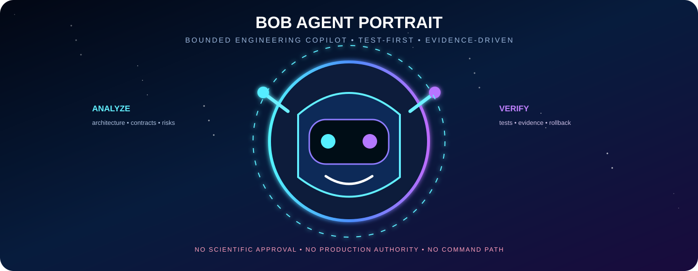</p>


<p align="center">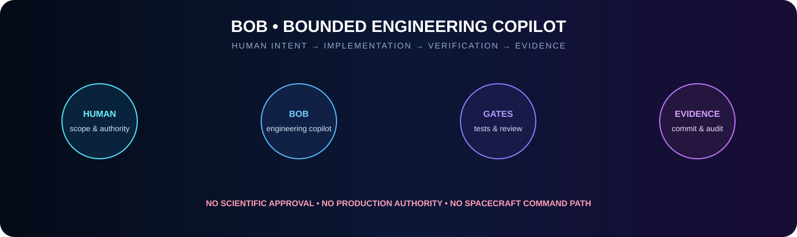</p>

Bob is the **Engineering copilot** used to help design, implement, inspect and qualify this repository. Bob is **not a deployed runtime service**, scientific authority, production operator or autonomous decision-maker inside AILORA.

### Bob's Responsibilities

| Responsibility | What Bob may do | Required evidence |
|---|---|---|
| **Repository analysis** | Inspect architecture, contracts, tests and migrations | File identities, diffs and reproducible diagnostics |
| **Implementation support** | Propose bounded code and documentation changes | Test-first failure, focused verification and atomic scope |
| **Quality assurance** | Run formatting, linting, typing, tests and coverage | Captured command output and fail-closed result |
| **Deployment preparation** | Diagnose Docker, Render and migration failures | Local build, health check and pinned commit evidence |
| **Documentation** | Maintain truthful architecture and release status | Links to source, tests, checkpoints and live endpoints |
| **Rollback protection** | Preserve clean state when a gate fails | Explicit rollback and post-failure repository status |

### Bob's Operating Contract

1. Human intent defines scope before any repository-changing action.
2. Changes are minimized, testable, reviewable and bound to explicit files.
3. Missing evidence, failed tests or conflicting state never becomes a pass.
4. Bob cannot approve scientific results or replace independent domain review.
5. Bob cannot authorize production use, paid services, credentials or legal claims.
6. Bob cannot execute spacecraft commands, uplinks or autonomous maneuvers.
7. Git pushes and deployments remain explicit human-controlled actions.
8. Every successful change ends with reproducible evidence and a clear next gate.

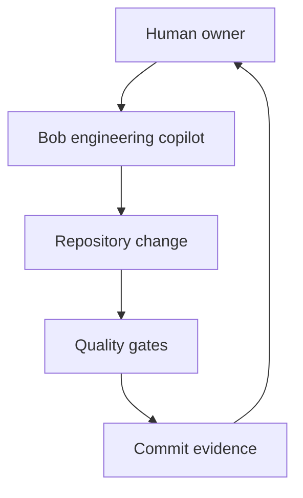

Bob improves the system that builds AILORA; Bob does not become an unbounded agent inside AILORA. Runtime identity, authorization, tenant isolation, scientific integrity and audit controls remain enforced by the application.

---

<!-- AILORA_CINEMATIC_V2_ROCKET -->

## Beyond the Horizon

<p align="center">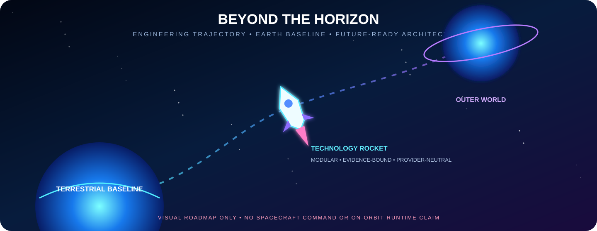</p>

This animated technology trajectory represents modular growth from the verified terrestrial prototype toward future capability. It is a visual roadmap only: no on-orbit runtime, autonomous maneuver or spacecraft command capability is claimed. NASA live data remains NOT ACTIVATED. Oya remains PLANNED, NOT CURRENTLY IMPLEMENTED, and DISABLED.

---

## Roadmap

<p align="center">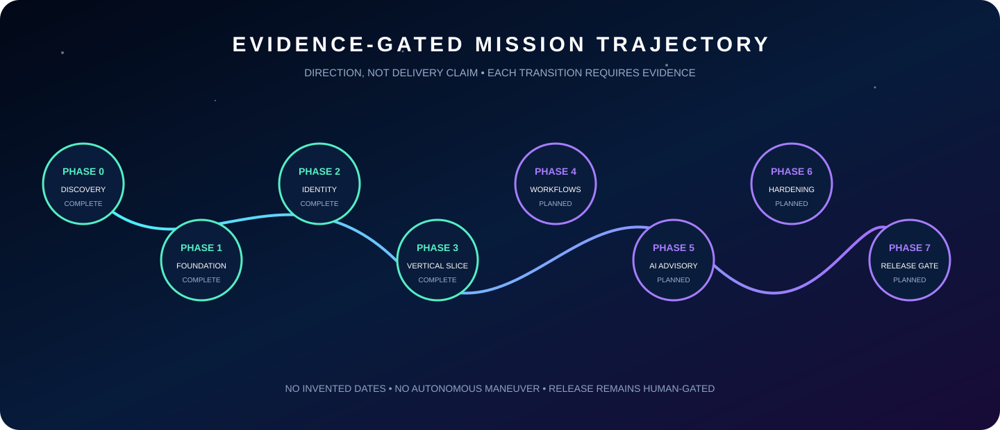</p>

The trajectory communicates verified direction without inventing delivery dates. Completed foundations remain distinct from planned capability, and every transition requires reproducible evidence, explicit authorization, rollback readiness and human review.

<!-- AILORA_FINAL_VISUAL_REDESIGN_BEGIN -->

## Live Prototype Boundaries

The public Render endpoint demonstrates deployment health and API availability; it does not convert prototype evidence into production, scientific, legal or operational approval.

- **NASA live data:** **NOT ACTIVATED**. Provider qualification, licensing, provenance and scientific approval remain mandatory gates.
- **Oya voice service:** **DISABLED**. The current adapter is no-op, network-free and non-billable.
- **Human authority:** **REQUIRED** for review and release decisions.
- **Scientific authority:** independent competent review remains external.
- **Operational authority:** no spacecraft command, uplink or autonomous maneuver path exists.
- **Production status:** live prototype deployment does not equal unrestricted production authorization.

---

## Project Timeline

| Event | Date |
|---|---|
| **Official Project Start** | 2026-08-05 |
| **Official Project End** | NOT_YET_COMPLETED |

---

## Documentation Index

| Document | Location | Description |
|---|---|---|
| Prompt Sequence (CSIP-EO-FMSP) | [`docs/prompt-sequence/`](docs/prompt-sequence/) | Authoritative 15-part governing specification |
| Prompt 01 — Architecture | [`docs/prompt-sequence/prompt-01.md`](docs/prompt-sequence/prompt-01.md) | Platform architecture and stack baseline |
| Prompt 06 — Scientific Truth | [`docs/prompt-sequence/prompt-06.md`](docs/prompt-sequence/prompt-06.md) | Astrodynamics contracts (DOMAIN_REVIEW_REQUIRED) |
| Prompt 15 — Development Contract | [`docs/prompt-sequence/prompt-15.md`](docs/prompt-sequence/prompt-15.md) | Execution, lifecycle, and gate contracts |
| Development Ledger | [`DEVLOG.md`](DEVLOG.md) | Commit-by-commit development log and decisions |
| Environment Template | [`.env.example`](.env.example) | Local development configuration template |
| Application Entry Point | [`src/ailora/main.py`](src/ailora/main.py) | AILORA application main module |
| API Application | [`src/ailora/api/app.py`](src/ailora/api/app.py) | FastAPI application factory |
| Health Router | [`src/ailora/api/routers/health.py`](src/ailora/api/routers/health.py) | Liveness and readiness probe endpoints |
| Health Tests | [`tests/test_health.py`](tests/test_health.py) | Health endpoint contract tests |
| README Contract Tests | [`tests/test_readme.py`](tests/test_readme.py) | Documentation truthfulness contract tests |
| Verification Baseline | [`docs/verification.md`](docs/verification.md) | Quality-gate evidence records by phase |

---

## Project Links Hub

> Canonical location for all project URLs and resource references.
> Resources marked **[placeholder]** are not yet deployed and will be updated
> upon official approval by Amin Azimi.

| Resource | URL / Location | Status |
|---|---|---|
| Repository (local) | `/Users/amin/Documents/bob-space-project-intake-2026` | Active |
| Remote Repository | [GitHub — azimilab2025-ai/ailora](https://github.com/azimilab2025-ai/ailora) | Active |
| CI/CD Pipeline | To be configured (GitHub Actions — PHASE_1) | **[placeholder]** |
| Deployed API | [https://ailora-web.onrender.com](https://ailora-web.onrender.com) | Live prototype |
| API Documentation (`/docs`) | [Live Swagger UI](https://ailora-web.onrender.com/docs) | Live prototype |
| API Documentation (`/redoc`) | [Live ReDoc](https://ailora-web.onrender.com/redoc) | Live prototype |
| Container Image (local) | `ailora:dev` (built via `docker build . -t ailora:dev`) | Local only |
| Container Registry | To be provided by Amin Azimi | **[placeholder]** |
| Project Website | [AILORA live prototype](https://ailora-web.onrender.com) | Live prototype |
| Demo Environment | [Render deployment](https://ailora-web.onrender.com) | Live prototype |

---


## Future Integration Roadmap: Oya Voice AI

> **PLANNED / NOT CURRENTLY IMPLEMENTED / DISABLED.** This section documents a candidate future integration only. No Oya package, API key, network call, paid service, runtime activation or production claim is introduced by this README redesign.

<p align="center">
  <a href="https://github.com/OyaAIProd/oya"></a>
</p>

<h3 align="center">OYA • PLAN, DON'T REACT</h3>
<p align="center"><strong>Candidate deterministic agent-runtime layer • evidence required before adoption</strong></p>

The [official Oya open-source repository](https://github.com/OyaAIProd/oya) describes a TypeScript/Bun runtime that asks the model for one typed dataflow plan and then executes a statically checked DAG. Intermediate values flow tool-to-tool by reference. Projection levels — `OPAQUE`, `SUMMARY`, and `TRANSPARENT` — control what the model can observe. Oya remains **PLANNED / NOT CURRENTLY IMPLEMENTED / DISABLED** in AILORA.

<p align="center">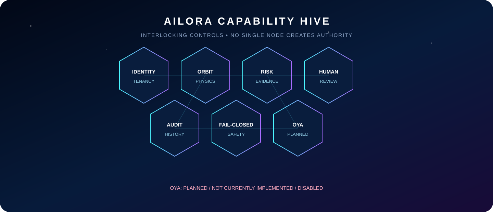</p>

### Candidate Execution Model

<p align="center">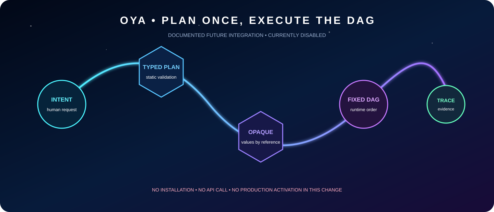</p>

- Planner emits a typed plan once; runtime validation precedes execution.
- Tool outputs default to opaque handles instead of being re-entered into the model context.
- Execution order is represented as a fixed DAG rather than repeatedly selected by a model loop.
- Trace and provenance evidence remain necessary at the AILORA boundary.
- Human authority and all existing fail-closed application controls remain final.

### Projection and Authority Boundary

<p align="center">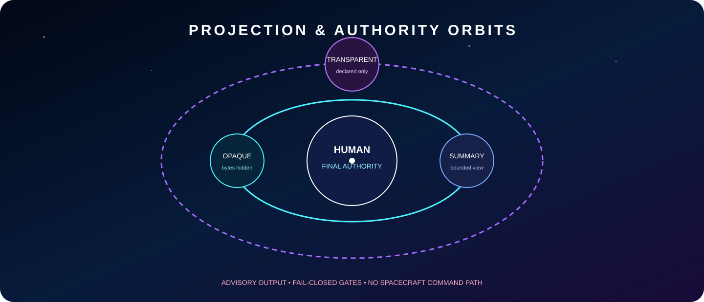</p>

`OPAQUE` hides raw bytes, `SUMMARY` exposes a bounded projection, and `TRANSPARENT` exposes a deliberately declared value. These are promising controls, not substitutes for AILORA authorization, scientific verification, tenant isolation, audit, cost control or human approval.

### Reproducible Evaluation Path

Official upstream installation starts with `bun add oyadotai zod`. Repository-level evaluation is documented through `make install && make demo`, `make test`, `make check`, and `make bench`. Any future AILORA trial must run in an isolated branch and sandbox with pinned upstream commit, dependency review, license review, secret-free fixtures, network-deny defaults, captured benchmark methodology, rollback evidence and explicit human authorization.

The upstream project reports benchmark observations including fewer tokens, lower latency, fixed ordering and zero corruption in its documented task. Those are upstream benchmark results, not independently verified AILORA findings. **No zero-error guarantee is claimed**, and no production or scientific suitability is inferred.

### Candidate Gate Sequence

**Research evidence → dependency and license review → isolated prototype → threat model → deterministic replay → performance benchmark → tenant and authorization tests → independent review → explicit activation decision.**

Until every gate passes, Oya remains **PLANNED / NOT CURRENTLY IMPLEMENTED / DISABLED**, provider-neutral, non-billable and disconnected from AILORA runtime paths.

Official sources: [Oya repository](https://github.com/OyaAIProd/oya) • [documentation directory](https://github.com/OyaAIProd/oya/tree/main/docs) • [benchmark methodology](https://github.com/OyaAIProd/oya/tree/main/benchmarks) • [MIT license](https://github.com/OyaAIProd/oya/blob/main/LICENSE)

## Command 19 Release-Candidate Evidence

The verified baseline entering Command 19 contains **624 tests** passing with **87.77%** statement coverage against an enforced 85% floor. Command 19 adds local-only continuity, privacy, legal-inventory, staging-smoke and rollback qualification; its final count is reported by the command output and checkpoint.

- Live NASA data: not activated; provider qualification, licensing and scientific approval remain external gates.
- Oya: disabled, no-op, non-billable and network-free; production activation remains an explicit external gate.
- Backup/restore: isolated SQLite qualification only; no production RPO/RTO, retention, encryption or recoverability claim.
- Release candidate: not production-ready and not deployed. All analytical outputs remain advisory-only; spacecraft command paths remain prohibited.

See `docs/runbooks/backup-restore.md`, `docs/runbooks/disaster-recovery.md`, `docs/runbooks/deployment-rollback.md`, `docs/governance/privacy-data-residency.md`, and `docs/governance/third-party-inventory.md`.

## Author

<p align="center"></p>

<h1 align="center">AMIN AZIMI</h1>
<h3 align="center">AI ARCHITECT</h3>
<p align="center"><strong>End-to-End System Architecture • Evidence-Based AI • Human-Governed Intelligence</strong></p>

AILORA is architected as a complete decision-support system: from governed data admission and physics-grounded analysis to uncertainty-aware risk, human review, durable evidence and fail-closed release controls. The author position is system-level and end-to-end, with responsibility centered on architectural integrity, reproducibility, safety boundaries and truthful technical communication.

<p align="center"><strong>Azimi Innovation Lab</strong><br/><em>Intelligence Beyond the Horizon</em></p>

> Profile links, portrait and verified external references will be added only after explicit authorization from Amin Azimi.

---

<p align="center"><strong>AILORA — An Azimi Innovation Lab Orbital Intelligence System</strong><br/><em>Intelligence Beyond the Horizon</em><br/>© Azimi Innovation Lab — All rights reserved</p>

</div>
