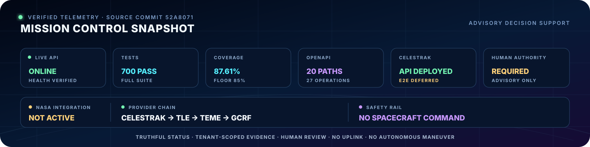
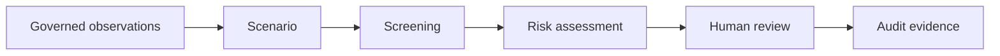
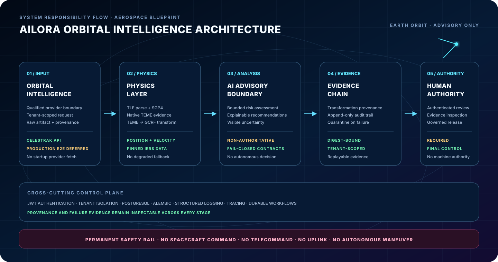
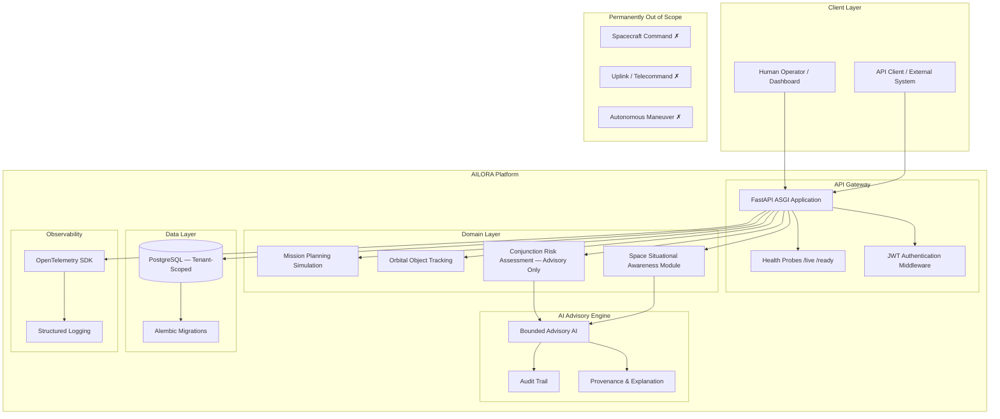
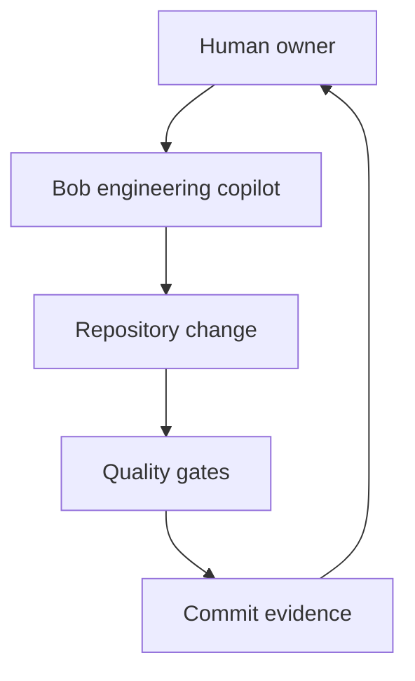

<div align="center">

# AILORA

<!-- AILORA_CANDIDATE_STATUS_BLOCK_V1 -->
## Release status (Production Candidate)

AILORA is a **Production Candidate under Active Qualification**.

The deployed software baseline is operational within the declared **advisory-only** scope.
This is **not** a claim of final Production Candidate — Active Qualification / Production-Qualified status.

Exact candidate baseline is recorded in `docs/qualification/final-release-manifest.json` (source_commit + alembic_head).
Open qualification gates remain explicit (HA, independent scientific/legal review, production IdP/MFA ops, OYA activation, real-email tenant E2E, and related PARTIAL ENT items).


<!-- AILORA_CINEMATIC_EXPERIENCE_BEGIN -->

<p align="center"></p>

<p align="center"><a href="https://ailora-web.onrender.com/health/live">Live Service</a> • <a href="https://ailora-web.onrender.com/docs">Interactive API</a> • <a href="#architecture">Architecture</a> • <a href="#bob-engineering-agent">Bob Agent</a> • <a href="#safety--scientific-integrity">Safety</a></p>

> **Production candidate — active qualification:** the Render service is live and the verified software baseline is operational. Analytical outputs remain advisory-only. NASA live data is **NOT ACTIVATED**. Oya is realigned to a library-agent direction (typed tool catalog + plan DAG). Hosted service model removed. Still disabled and non-billable by design.

<!-- AILORA_CINEMATIC_EXPERIENCE_END -->


### An Azimi Innovation Lab Orbital Intelligence System

*Intelligence Beyond the Horizon*

---


**AILORA is a space decision-support, analysis, and simulation platform providing integrated
situational awareness of Earth-orbit objects and activities.** It supports human decision-making
through governed evidence, explainable analysis, and bounded risk assessment — operating on
Physics-First and AI-Advisory-Only principles.

> ⚠️ **Advisory-Only Statement:** All AI outputs produced by AILORA are strictly advisory.
> The platform makes no autonomous operational decisions and maintains a **permanent prohibition**
> on any spacecraft command, telecommand, uplink, or autonomous maneuver execution path.
> This prohibition is absolute and applies under all conditions, modes, and extensions.

</div>

---

## Official Demo

<!-- AILORA_CINEMATIC_V2_DEMO -->

### 30-Second Swagger Demo

<p align="center"></p>

> **DEMO RECORDING SLOT:** reserved for an approved 30-second Swagger walkthrough. No recording is attached yet. The live API remains available at [Swagger UI](https://ailora-web.onrender.com/docs).


> **(see Candidate Evidence Pack) — (see Candidate Evidence Pack) after official approval by Amin Azimi.**
>
> A reproducible demo scenario demonstrating end-to-end conjunction risk assessment
> and advisory recommendation will be published here upon completion of the
> controlled authenticated production E2E and its release evidence are approved.

---

## Mission Control Snapshot

<!-- AILORA_MISSION_CONTROL_STRIP -->

<p align="center"></p>

This telemetry strip is a compact view of verified repository and deployed-surface evidence. The inspectable table below remains authoritative; the controlled authenticated production E2E provider exercise is explicitly deferred, and no NASA runtime integration is claimed.

| Control-plane signal | Verified state |
|---|---|
| **Live API** | [`ailora-web.onrender.com`](https://ailora-web.onrender.com) |
| **Liveness** | [`/health/live`](https://ailora-web.onrender.com/health/live) |
| **Interactive OpenAPI** | [`/docs`](https://ailora-web.onrender.com/docs) |
| **API surface** | 20 OpenAPI paths / 27 operations |
| **Automated verification** | 1065 tests passing |
| **Statement coverage** | 88.77% against an enforced 85% floor |
| **Deployment model** | Live Render service; enterprise qualification in progress |
| **CelesTrak provider chain** | **API DEPLOYED** — controlled production E2E deferred |
| **NASA integration** | **NOT ACTIVE** — no NASA runtime provider is connected |
| **Oya library-agent** | **DISABLED** — typed catalog + plan validation, no network clients, non-billable |
| **Human authority** | **REQUIRED** — AI output remains advisory |
| **Spacecraft commands** | **PERMANENTLY PROHIBITED** |

---

<!-- AILORA_CINEMATIC_V2_GALLERY -->

## Project Visual Gallery

<p align="center"></p>

**MEDIA PLACEHOLDERS:** four approved screenshots will replace these frames after final capture and privacy review: **GitHub**, **Render**, **Swagger**, and **Project Workspace**. Placeholder graphics are presentation scaffolding, not evidence of production authorization.

---

## Table of Contents

1. [Why AILORA](#why-ailora)
2. [Capabilities](#capabilities)
3. [Architecture](#architecture)
4. [Technology Stack](#technology-stack)
5. [Quick Start](#quick-start)
6. [API Reference](#api-reference)
7. [Testing & Quality](#testing--quality)
8. [Safety & Scientific Integrity](#safety--scientific-integrity)
9. [Roadmap](#roadmap)
10. [Project Timeline](#project-timeline)
11. [Documentation Index](#documentation-index)
12. [Project Links Hub](#project-links-hub)
13. [Author](#author)

---

<!-- AILORA_CINEMATIC_V2_CONNECTED_WORLDS -->

## Connected Worlds

<p align="center"></p>

AILORA connects the orbital world to the human decision world through a governed evidence bridge. Provenance, uncertainty, review state and audit context may cross that bridge; operational spacecraft authority never does.

---

## Why AILORA

Earth's orbital environment is increasingly congested. Thousands of active satellites and
hundreds of thousands of debris objects create a growing risk of collision that demands
continuous monitoring, accurate risk assessment, and rapid human decision-making.

Existing tools are often closed, single-purpose, or lack the architectural rigour needed
for enterprise-grade integration. AILORA addresses this gap by providing:

| Principle | Meaning |
|---|---|
| **Physics-First** | All risk calculations are grounded in established orbital mechanics — no unverified heuristics |
| **AI-Advisory-Only** | AI outputs are recommendations to human operators, never autonomous decisions |
| **Evidence-Based** | Every output carries data provenance, uncertainty bounds, and audit trail |
| **Explainability** | Risk levels and recommendations include human-readable explanations |
| **Bounded Scope** | The platform operates within clearly defined, auditable capability boundaries |

AILORA targets **LEO · MEO · GEO · HEO** orbital regimes and delivers integrated
situational awareness as a Challenge-ready Enterprise SaaS Foundation.

---

<!-- AILORA_CINEMATIC_V2_EVIDENCE -->

## Evidence Constellation

<p align="center"></p>

The visual sequence presents the system as one continuous mission narrative: **Observe → Analyze → Assess → Review → Audit**. Dense verification tables remain below as inspectable evidence, while this layer communicates the architecture at a glance.

---

## Capabilities

### ✅ Implemented and verified within declared scope

| Capability | Current evidence | Boundary |
|---|---|---|
| Health and API composition | Versioned routers, RFC 9457 errors, correlation, bounded requests, ETags and signed cursors | Runtime deployment acceptance remains separate |
| PostgreSQL persistence and Alembic | Tenant-scoped models through revision `0014_audit_integrity`, forced RLS, transaction-local tenant context and hash-chained append-only audit source | Controlled migration, pre-provisioned roles/extensions and production PostgreSQL qualification remain separate |
| Identity, sessions and authorization | Tenant membership, OIDC/MFA session policy, asymmetric tokens and tenant-bound workload authorization | Live IdP/OAuth integration and operational qualification remain separate |
| SSA evidence chain | Scenario → screening → proximity assessment → review → tenant-ordered SHA-256 audit evidence with fail-closed reads | Human-authority-first; live PostgreSQL trigger validation remains separate |
| Space-data provider chain | Qualified-gate boundary, raw artifacts, quarantine, TLE parsing and CelesTrak transport | Controlled authenticated production E2E is deferred |
| Astrodynamics foundation | SGP4/TEME, bounded TCA, covariance health and pinned-IERS TEME→GCRF | Independent operational scientific qualification remains required |
| Scientific reproducibility | Content-addressed algorithm, dataset, configuration, runtime and tolerance registry with deterministic execution manifests and fail-closed drift comparison | Runtime-path adoption, independent configuration review and operational scientific acceptance remain separate |
| Supply-chain admission | Complete locked-dependency CycloneDX inventory plus signed, digest-bound SAST/SCA/container/history, VEX and SLSA-provenance verification | Scanner execution, protected signing identity, immutable registry and deployment admission remain external |
| Durable workflows | Tenant-scoped idempotency, retries, cancellation and deterministic replay | External queue/worker HA remains planned |
| Recovery qualification | Digest-bound isolated-drill evidence with observed RPO, validated-serving RTO and reconciliation RCO | Managed PITR, production topology, objectives and drill evidence remain external |
| Engineering assurance | Ruff, strict Mypy, 1065 tests, 88.77% coverage, complete-lock SBOM and package build | Test evidence is not external certification |
| Deployment foundation | Non-root container contract and live Render service | Multi-instance HA/DR/SLO evidence remains planned |

### 🔄 Active qualification

- Enterprise identity, workload authorization and database-enforced tenant isolation.
- Scientific manifest adoption, independent configuration review, reference execution and covariance propagation.
- Provider/data qualification, collision-probability science and operational evidence.
- Protected supply-chain signing, scanner execution, immutable registry enforcement, measured
  SLO/DR, shadow operation and independent assurance.

### 📋 Next qualified capabilities

The implementation roadmap is evidence-driven. Existing components are extended rather than
rebuilt, and each release-specific claim requires implementation, verification, immutable
evidence, qualified review and accepted residual risk.

> The current `risk_level` compatibility field is a **distance-based proximity severity** from
> T0/PHY-C1 screening. **Proximity severity ≠ collision probability ≠ operational decision.**
> A future `ConjunctionRiskAssessmentV2` will introduce qualified covariance, HBR and Pc semantics
> without relabeling the current distance thresholds as collision risk.
>
> C-10 provides advisory SGP4 propagation with native TEME outputs. The production pipeline
> performs the separately evidenced TEME-to-GCRF transform; independent operational scientific
> approval remains a separate gate.
>
> C-11 provides bounded TCA search and explicit TEME covariance-health contracts. It does not
> compute collision probability, propagate covariance or recommend maneuvers.
>
> C-12 provides a fail-closed differential-verification contract. It does not install a second
> engine or self-issue scientific approval.

### External qualification gates

| Area | Current condition | Required evidence |
|---|---|---|
| Scientific operation | Advisory implementation exists | Independent engine, corpus, reviewer and accepted validity domain |
| Provider operation | Transport and governance boundary exist | Legal/technical qualification plus controlled tenant E2E |
| Enterprise release | Live software candidate exists | HA/DR/SLO, pentest, shadow pilot and human release decision |

---

## Cinematic System Journey



AILORA treats every analytical journey as a governed evidence chain. Inputs are tenant-scoped, transformations are traceable, uncertainty remains visible, and recommendations cannot silently become operational authority.

| Journey layer | Responsibility | Safety boundary |
|---|---|---|
| **Observe** | Admit typed, provenance-bearing observations | Invalid data never becomes trusted evidence |
| **Analyze** | Build scenarios, screenings and risk assessments | Results remain advisory and uncertainty-aware |
| **Review** | Present evidence to an authenticated human | Review does not create spacecraft command authority |
| **Record** | Persist append-only audit and workflow evidence | Historical evidence is preserved |
| **Recover** | Replay durable workflows and transitions | Failure degrades safely and remains observable |

---

## Architecture

<!-- AILORA_AEROSPACE_BLUEPRINT -->

<p align="center"></p>

The blueprint summarizes responsibility flow from governed orbital input to human authority. It supplements the detailed technical Mermaid architecture below; it does not replace component-level contracts or imply operational approval.

The security foundation now includes an opt-in, offline-qualified RS256 access-token profile with
exact issuer and audience validation, mandatory `jti`, public-only JWKS publication and bounded
verification overlap during key rotation. Existing runtime authentication is not silently switched:
production activation still requires protected key custody, approved configuration, OIDC integration,
operational rotation evidence and an explicit deployment decision.

The next identity layer adds a provider-neutral, injected-JWKS OIDC verification boundary and an
immutable session-assurance policy for nonce binding, token freshness, refresh-family replay
detection, absolute/idle expiry, idempotent logout and recent MFA before privileged effects. It is
offline-qualified and disabled from runtime routing; authorization-code exchange, account linking,
production IdP configuration and durable session-state integration remain explicit later gates.

The workload-identity foundation verifies short-lived RS256 OAuth client-credentials access tokens
against an injected key ring and an explicit registration catalog. Workload subject, OAuth client,
tenant, scope, permission, resource and action must all agree; revocation is rechecked immediately
before authorization. Human identity claims, wildcard scopes, cross-tenant transitions and any
spacecraft-command authority are rejected. This provider-neutral policy is not a live token endpoint,
does not store a client secret and remains disabled from runtime routing until tenant credentials,
durable registration state and controlled production qualification are approved.

Contextual authorization now adds a closed permission-to-resource/action catalog, trusted membership
tenant reconciliation, principal and actor-class separation, purpose limitation, classification and
object ceilings, policy-version fencing, current identity/session/credential checks and recent MFA
for privileged human effects. Ambient delegation, stale grants, lateral resource access and workload
use of human-only privileges fail closed. The policy remains an offline foundation: middleware and
repository enforcement, durable policy state and controlled production tenant evidence are not yet
activated or qualified.

The AILORA platform is structured as layered vertical concerns, each with defined
interfaces, data standards, and governance contracts.



**Platform scope:** `EARTH_ORBIT_ONLY` — Active regimes: LEO · MEO · GEO · HEO

**Tenancy model:** `shared_database_with_tenant_key` (Prompt 15 §12 default)

---

## Technology Stack

> Only packages present in [`pyproject.toml`](pyproject.toml) and approved from the Prompt 01 candidate stack.

| Layer | Technology | Version |
|---|---|---|
| **Runtime** | Python | ≥ 3.11 |
| **Web Framework** | FastAPI | ≥ 0.115 |
| **ASGI Server** | Uvicorn (standard) | ≥ 0.32 |
| **Data Validation** | Pydantic v2 | ≥ 2.9 |
| **Configuration** | pydantic-settings | ≥ 2.6 |
| **ORM** | SQLAlchemy | ≥ 2.0 |
| **Migrations** | Alembic | ≥ 1.14 |
| **Database** | PostgreSQL | 16 (docker-compose) |
| **DB Driver** | psycopg (v3) | ≥ 3.2 |
| **Authentication** | python-jose + passlib (bcrypt) | ≥ 3.3 / ≥ 1.7 |
| **HTTP Client** | httpx | ≥ 0.28 |
| **Structured Logging** | structlog | ≥ 24.4 |
| **Observability** | OpenTelemetry SDK + FastAPI instrumentation | ≥ 1.28 |
| **Packaging / Env** | uv | current |
| **Linting / Formatting** | ruff | ≥ 0.8 |
| **Type Checking** | mypy (strict) | ≥ 1.13 |
| **Testing** | pytest + pytest-asyncio + pytest-cov | ≥ 8.3 |
| **Build Backend** | hatchling | current |

---

## Quick Start

**Prerequisites:** Python 3.11+, [uv](https://github.com/astral-sh/uv), Docker (optional)

```bash
# 1. Clone the repository
git clone <repository-url> ailora
cd ailora

# 2. Install dependencies (uv resolves and creates .venv automatically)
export PATH="$HOME/Library/Python/3.9/bin:$PATH"   # adjust if uv is on PATH already
uv sync

# 3. Copy environment template
cp .env.example .env

# 4. Run the quality suite (lint, type-check, tests)
uv run ruff format --check src/ tests/
uv run ruff check src/ tests/
uv run mypy src/
uv run pytest tests/ -v

# 5. Start the development server
uv run uvicorn ailora.api.app:app --reload --host 0.0.0.0 --port 8000

# — or use the Makefile shortcuts —
make lint
make test
make run
```

> **Docker Quick Start** (requires Dockerfile — see [Roadmap](#roadmap) for current P0-07 status):
>
> ```bash
> docker build . -t ailora:dev
> docker compose up
> ```

---

## API Reference

> A running server is required to access the interactive API documentation.
> Start the server with `uv run uvicorn ailora.api.app:app --reload` then open:

| Endpoint | Description |
|---|---|
| `GET /health/live` | Liveness probe — confirms process is alive |
| `GET /health/ready` | Readiness probe — confirms service is ready to handle traffic |
| `/docs` | Swagger UI (interactive API explorer) |
| `/redoc` | ReDoc UI (documentation-focused view) |
| `/openapi.json` | Raw OpenAPI 3 schema |

---

## Testing & Quality

### Running the Test Suite

```bash
export PATH="$HOME/Library/Python/3.9/bin:$PATH"

# Full suite with coverage
uv run pytest tests/ -v

# No coverage (faster)
uv run pytest tests/ -v --no-cov

# Specific test module
uv run pytest tests/test_health.py -v --no-cov
uv run pytest tests/test_readme.py -v --no-cov
```

### Quality Gates

```bash
# Format check
uv run ruff format --check src/ tests/

# Lint
uv run ruff check src/ tests/

# Type check (strict)
uv run mypy src/

# All via Makefile
make lint && make test
```

### Current Results (Gate 8 baseline)

```
ruff format --check   ✅  11 files, all formatted
ruff check            ✅  0 issues (7 source files)
mypy (strict)         ✅  0 issues (7 source files, strict mode)
pytest                ✅  51 tests collected, 51 passed
  tests/test_health.py          —  2 tests (liveness, readiness)
  tests/test_readme.py          — 35 tests (documentation contract)
  tests/test_docker_contracts.py — 14 tests (Dockerfile/docker-compose contracts)
```

---

## Safety & Scientific Integrity

### Advisory-Only Boundary (Permanent)

All AI and analytical outputs produced by AILORA are **strictly advisory**. The platform
supports human decision-making — it does not replace it. No output from AILORA constitutes
an operational command, clearance, or normative recommendation for spacecraft operations.

### Permanently Prohibited — No Exceptions

The following capabilities are **not "not yet implemented"** — they are permanently out of
scope under all conditions, modes, and extensions (`E9 / APR-X / INC-0 / HARD_DENY`):

- **Spacecraft Command**
- **Telecommand**
- **Uplink**
- **Flight Control Execution**
- **Autonomous Maneuver Execution**

### Prompt 06 Domain Review Status

```
PROMPT_06_DOMAIN_REVIEW = PARTIAL / STILL OPEN
SENTINEL                = DOMAIN_REVIEW_REQUIRED — NOT_NORMATIVELY_ACTIVATED
SOURCE                  = CSIP-EO-RS-STAGE-20 / 0.1.0-reconstituted-draft
```

Prompt 06 (`CSIP-EO-RS-STAGE-20`) carries a standing `DOMAIN_REVIEW_REQUIRED` sentinel.
The Astrodynamics and scientific-algorithm contracts defined in Prompt 06 have **not**
received the independent qualified scientific review required to achieve Normative or
Operational status.

**Effect on the project:**

- All conjunction-risk and collision-probability outputs are presented as **Advisory,
  Bounded, and non-Normative** until this review is completed.
- No scientific output may be labelled Normative, Qualified, or Operationally Authoritative.
- This gate is **non-blocking** for identity and foundation development, but **blocking**
  for any Normative scientific claim.

### Oya — Library-Agent Direction

> **Status: REALIGNED / LIBRARY-AGENT / DISABLED BY DESIGN**

Oya has been realigned from the previous hosted-service concept to a pure
library-agent surface. The package now provides a governed typed tool catalog
(`agent_tools.py`) and plan/DAG validation (`typed_plan.py`). All tools map
exclusively to existing AILORA HTTP routes. No external network clients, no
API keys, no voice session, and no hosted configuration remain.

The feature stays disabled and non-billable. Activation still requires explicit
authorization from Amin Azimi.

See [Future Integration Roadmap: Oya Library-Agent](#future-integration-roadmap-oya-voice-ai)
for the updated architecture.

---

## Bob Engineering Agent

<!-- AILORA_CINEMATIC_V2_BOB_PORTRAIT -->

### Bob Agent Portrait

<p align="center"></p>


<p align="center"></p>

Bob is the **Engineering copilot** used to help design, implement, inspect and qualify this repository. Bob is **not a deployed runtime service**, scientific authority, production operator or autonomous decision-maker inside AILORA.

### Bob's Responsibilities

| Responsibility | What Bob may do | Required evidence |
|---|---|---|
| **Repository analysis** | Inspect architecture, contracts, tests and migrations | File identities, diffs and reproducible diagnostics |
| **Implementation support** | Propose bounded code and documentation changes | Test-first failure, focused verification and atomic scope |
| **Quality assurance** | Run formatting, linting, typing, tests and coverage | Captured command output and fail-closed result |
| **Deployment preparation** | Diagnose Docker, Render and migration failures | Local build, health check and pinned commit evidence |
| **Documentation** | Maintain truthful architecture and release status | Links to source, tests, checkpoints and live endpoints |
| **Rollback protection** | Preserve clean state when a gate fails | Explicit rollback and post-failure repository status |

### Bob's Operating Contract

1. Human intent defines scope before any repository-changing action.
2. Changes are minimized, testable, reviewable and bound to explicit files.
3. Missing evidence, failed tests or conflicting state never becomes a pass.
4. Bob cannot approve scientific results or replace independent domain review.
5. Bob cannot authorize production use, paid services, credentials or legal claims.
6. Bob cannot execute spacecraft commands, uplinks or autonomous maneuvers.
7. Git pushes and deployments remain explicit human-controlled actions.
8. Every successful change ends with reproducible evidence and a clear next gate.



Bob improves the system that builds AILORA; Bob does not become an unbounded agent inside AILORA. Runtime identity, authorization, tenant isolation, scientific integrity and audit controls remain enforced by the application.

---

<!-- AILORA_CINEMATIC_V2_ROCKET -->

## Beyond the Horizon

<p align="center"></p>

This animated technology trajectory represents modular growth from the verified terrestrial production-candidate baseline toward future capability. It is a visual roadmap only: no on-orbit runtime, autonomous maneuver or spacecraft command capability is claimed. NASA live data remains NOT ACTIVATED. Oya is realigned to library-agent direction and remains DISABLED / NON-BILLABLE.

---

## Roadmap

<p align="center"></p>

The trajectory communicates verified direction without inventing delivery dates. Completed foundations remain distinct from planned capability, and every transition requires reproducible evidence, explicit authorization, rollback readiness and human review.

<!-- AILORA_FINAL_VISUAL_REDESIGN_BEGIN -->

## Live Deployment and Qualification Boundaries

The public Render endpoint demonstrates deployment health and API availability; release-specific scientific, legal, security and operational qualification requires separate evidence.

- **NASA live data:** **NOT ACTIVATED**. Provider qualification, licensing, provenance and scientific approval remain mandatory gates.
- **Oya library-agent:** **DISABLED**. Typed catalog + plan validation, no network clients, non-billable.
- **Human authority:** **REQUIRED** for review and release decisions.
- **Scientific authority:** independent competent review remains external.
- **Operational authority:** no spacecraft command, uplink or autonomous maneuver path exists.
- **Production status:** live production candidate under active release qualification.

---

## Project Timeline

| Event | Date |
|---|---|
| **Official Project Start** | 2026-08-05 |
| **Official Project End** | NOT_YET_COMPLETED |

---

## Documentation Index

| Document | Location | Description |
|---|---|---|
| Prompt Sequence (CSIP-EO-FMSP) | [`docs/prompt-sequence/`](docs/prompt-sequence/) | Authoritative 15-part governing specification |
| Prompt 01 — Architecture | [`docs/prompt-sequence/prompt-01.md`](docs/prompt-sequence/prompt-01.md) | Platform architecture and stack baseline |
| Prompt 06 — Scientific Truth | [`docs/prompt-sequence/prompt-06.md`](docs/prompt-sequence/prompt-06.md) | Astrodynamics contracts (DOMAIN_REVIEW_REQUIRED) |
| Prompt 15 — Development Contract | [`docs/prompt-sequence/prompt-15.md`](docs/prompt-sequence/prompt-15.md) | Execution, lifecycle, and gate contracts |
| Development Ledger | [`DEVLOG.md`](DEVLOG.md) | Commit-by-commit development log and decisions |
| Environment Template | [`.env.example`](.env.example) | Local development configuration template |
| Application Entry Point | [`src/ailora/main.py`](src/ailora/main.py) | AILORA application main module |
| API Application | [`src/ailora/api/app.py`](src/ailora/api/app.py) | FastAPI application factory |
| Health Router | [`src/ailora/api/routers/health.py`](src/ailora/api/routers/health.py) | Liveness and readiness probe endpoints |
| Health Tests | [`tests/test_health.py`](tests/test_health.py) | Health endpoint contract tests |
| README Contract Tests | [`tests/test_readme.py`](tests/test_readme.py) | Documentation truthfulness contract tests |
| Verification Baseline | [`docs/verification.md`](docs/verification.md) | Quality-gate evidence records by phase |

---

## Project Links Hub

> Canonical location for all project URLs and resource references.
> Resources marked **[placeholder]** are not yet deployed and will be updated
> upon official approval by Amin Azimi.

| Resource | URL / Location | Status |
|---|---|---|
| Repository (local) | `/Users/amin/Documents/bob-space-project-intake-2026` | Active |
| Remote Repository | [GitHub — azimilab2025-ai/ailora](https://github.com/azimilab2025-ai/ailora) | Active |
| CI/CD Pipeline | [GitHub Actions](https://github.com/azimilab2025-ai/ailora/actions) | Active quality gates |
| Deployed API | [https://ailora-web.onrender.com](https://ailora-web.onrender.com) | Live deployment |
| API Documentation (`/docs`) | [Live Swagger UI](https://ailora-web.onrender.com/docs) | Live deployment |
| API Documentation (`/redoc`) | [Live ReDoc](https://ailora-web.onrender.com/redoc) | Live deployment |
| Container Image (local) | `ailora:dev` (built via `docker build . -t ailora:dev`) | Local only |
| Container Registry | To be provided by Amin Azimi | **[placeholder]** |
| Project Website | [AILORA live service](https://ailora-web.onrender.com) | Live deployment |
| Demo Environment | [Render deployment](https://ailora-web.onrender.com) | Live deployment |

---


## Future Integration Roadmap: Oya Library-Agent

> **REALIGNED / LIBRARY-AGENT / DISABLED BY DESIGN.** Oya now provides a typed tool catalog and plan validation surface. Hosted service model, API keys, network clients and voice session have been removed. The feature remains disabled and non-billable.

<p align="center">
  <a href="https://github.com/OyaAIProd/oya"></a>
</p>

<h3 align="center">OYA • LIBRARY-AGENT (TYPED CATALOG + PLAN DAG)</h3>
<p align="center"><strong>Governed library-agent surface • typed tools map only to existing AILORA routes • still disabled</strong></p>

Oya inside AILORA is now a pure library-agent surface. It exposes a governed typed tool catalog and a plan/DAG validator. All tools map exclusively to existing AILORA HTTP routes. No external network clients, no API keys, no voice session and no hosted configuration are present. The feature remains **DISABLED / NON-BILLABLE** by design until explicit authorization.

<p align="center"></p>

### Candidate Execution Model

<p align="center"></p>

- Planner emits a typed plan once; runtime validation precedes execution.
- Tool outputs default to opaque handles instead of being re-entered into the model context.
- Execution order is represented as a fixed DAG rather than repeatedly selected by a model loop.
- Trace and provenance evidence remain necessary at the AILORA boundary.
- Human authority and all existing fail-closed application controls remain final.

### Projection and Authority Boundary

<p align="center"></p>

`OPAQUE` hides raw bytes, `SUMMARY` exposes a bounded projection, and `TRANSPARENT` exposes a deliberately declared value. These are promising controls, not substitutes for AILORA authorization, scientific verification, tenant isolation, audit, cost control or human approval.

### Reproducible Evaluation Path

Official upstream installation starts with `bun add oyadotai zod`. Repository-level evaluation is documented through `make install && make demo`, `make test`, `make check`, and `make bench`. Any future AILORA trial must run in an isolated branch and sandbox with pinned upstream commit, dependency review, license review, secret-free fixtures, network-deny defaults, captured benchmark methodology, rollback evidence and explicit human authorization.

The upstream project reports benchmark observations including fewer tokens, lower latency, fixed ordering and zero corruption in its documented task. Those are upstream benchmark results, not independently verified AILORA findings. **No zero-error guarantee is claimed**, and no production or scientific suitability is inferred.

### Candidate Gate Sequence

**Research evidence → dependency and license review → isolated production-grade → threat model → deterministic replay → performance benchmark → tenant and authorization tests → independent review → explicit activation decision.**

Until every gate passes and explicit authorization is granted, Oya remains **DISABLED BY DESIGN**, provider-neutral, non-billable and disconnected from AILORA runtime paths.

Official sources: [Oya repository](https://github.com/OyaAIProd/oya) • [documentation directory](https://github.com/OyaAIProd/oya/tree/main/docs) • [benchmark methodology](https://github.com/OyaAIProd/oya/tree/main/benchmarks) • [MIT license](https://github.com/OyaAIProd/oya/blob/main/LICENSE)

## Current Qualification Baseline

The current verified repository baseline contains **1065 tests passing**, **88.77%** statement
coverage against the enforced 85% floor, **20 OpenAPI paths / 27 operations**, and one Alembic
head through revision `0014_audit_integrity`. The Render service is live; controlled
authenticated provider E2E remains a required deferred qualification exercise.

- NASA runtime integration is not active; CelesTrak is the directly integrated GP source.
- Oya library-agent surface is present, disabled and non-billable pending explicit authorization.
- Backup/restore evidence records isolated local RPO/RTO/RCO observations only; managed PITR,
  objectives and production recovery qualification remain open.
- Scientific execution manifests are deterministic and reject registry, runtime, tolerance, seed
  and source drift; they remain local evidence and cannot self-authorize scientific operation.
- Supply-chain evidence admission rejects mutable artifact references, rebuilds, missing or failed
  scan classes, unresolved VEX, untrusted builders or keys, signature tampering and expired evidence;
  it verifies evidence only and cannot authorize deployment.
- Proximity severity is distance-based and must never be represented as collision probability.
- All analytical outputs remain advisory-only; spacecraft command paths remain prohibited.

See `docs/runbooks/backup-restore.md`, `docs/runbooks/disaster-recovery.md`,
`docs/runbooks/deployment-rollback.md`, `docs/governance/privacy-data-residency.md`, and
`docs/governance/third-party-inventory.md`.

## Author

<p align="center"></p>

<h1 align="center">AMIN AZIMI</h1>
<h3 align="center">AI ARCHITECT</h3>
<p align="center"><strong>End-to-End System Architecture • Evidence-Based AI • Human-Governed Intelligence</strong></p>

AILORA is architected as a complete decision-support system: from governed data admission and physics-grounded analysis to uncertainty-aware risk, human review, durable evidence and fail-closed release controls. The author position is system-level and end-to-end, with responsibility centered on architectural integrity, reproducibility, safety boundaries and truthful technical communication.

<p align="center"><strong>Azimi Innovation Lab</strong><br/><em>Intelligence Beyond the Horizon</em></p>

> Profile links, portrait and verified external references will be added only after explicit authorization from Amin Azimi.

---

<p align="center"><strong>AILORA — An Azimi Innovation Lab Orbital Intelligence System</strong><br/><em>Intelligence Beyond the Horizon</em><br/>© Azimi Innovation Lab — All rights reserved</p>

</div>

<!-- ENTERPRISE_LIVE_SPACE_DATA_FOUNDATION -->
### Live Orbital-Data Foundation

AILORA now contains a **real, bounded HTTPS transport path for CelesTrak GP data** with
canonical-host enforcement, no redirect following, bounded timeout/response size, normalized
transport failures, provider provenance, qualification gates, retry/circuit-breaker support,
and an explicit runtime enable switch. The Render blueprint activates the switch for the
authenticated production API; each request still fails closed unless current provider
qualification evidence exists.

The live-data engineering path uses CelesTrak as the directly integrated public GP source.
NASA's public TLE API is CelesTrak-derived, so it is **not treated as an independent
cross-validation source**. Independent source diversity and higher-assurance operational
orbital data remain later qualification work. No Oya package, connection, credential, or
runtime action is introduced by this command.


<!-- ENTERPRISE_COMMAND_02_INTERNAL_RUNTIME -->
### Governed Live-Provider Runtime Composition

AILORA includes an internal, fail-closed composition path joining the CelesTrak adapter,
bounded retry, circuit breaking, qualification enforcement and tenant-scoped append-only
ingestion. The composition is reachable only through the authenticated tenant-scoped space-data
API and performs no startup network action. Provider qualification remains mandatory and cannot
be bypassed.

<!-- COMMAND_03_NATIVE_TEME_BRIDGE -->
### Native TEME Provider-to-Observation Bridge

AILORA now contains an internal, test-first bridge that parses bounded qualified-provider TLE
bytes, propagates them through the existing SGP4 service, preserves the native **TEME** frame,
builds canonical tenant-scoped provenance and routes malformed, mismatched or out-of-domain
inputs to sanitized quarantine evidence. The bridge performs no frame relabeling. The production
API now composes it with the qualified GCRF transformer while preserving the native TEME record.

TEME-to-GCRF conversion is possible only through a separately qualified transformation using
governed Earth-orientation inputs, including UT1-UTC and polar motion from an approved IERS
data snapshot, explicit time-scale handling, dependency and license review, deterministic
offline replay and independent reference-vector verification. That transformation gate is now
implemented; unsupported epochs or unavailable qualified inputs still fail closed.

<!-- COMMAND_04_DETERMINISTIC_OFFLINE_GCRF -->
### Deterministic Governed TEME-to-GCRF Transformation

AILORA now provides a typed, deterministic transformation from native SGP4 **TEME** state
vectors to the project-level **GCRF** contract. The concrete implementation realization is
Astropy **GCRS**; that realization is recorded explicitly rather than silently treating a
TEME vector as GCRF. Position and velocity transform together at the same timezone-aware UTC
epoch and retain kilometre and kilometre-per-second units.

The scientific runtime is reproducibly pinned to `astropy==8.0.1` and
`astropy-iers-data==0.2026.8.10.0.32.39`. IERS and leap-second automatic downloads are disabled
during every transformation. The result records the Astropy version, IERS-data version,
bundled `finals2000A.all` coverage range, Earth-orientation status, dataset SHA-256 digest,
input digest, and transformation digest. Epochs outside the pinned dataset are rejected
explicitly; degraded-accuracy fallback is not permitted.

The Command 03 provider bridge continues to preserve native TEME evidence. Consumers that
require GCRF invoke this qualified transformation before assigning the GCRF label. Outputs remain
advisory-only and still require independent scientific validation before any operational use.

<!-- COMMAND_05_PRODUCTION_PROVIDER_GCRF_WIRING -->
### Production Provider-to-GCRF Wiring

The authenticated tenant-scoped space-data API now composes current provider qualification,
bounded CelesTrak HTTPS retrieval, append-only raw-artifact storage, strict TLE parsing, SGP4
propagation, native TEME persistence, the pinned Astropy GCRS realization of GCRF, append-only
transformation provenance, and final GCRF observation persistence. The API returns a GCRF label
only after position and velocity are transformed together successfully.

Provider qualification evidence is registered only by an authenticated active platform
superuser and is stored with its terms digest, reviewer reference, validity window, license and
attribution. Tenant authorization and qualification are checked before any provider network
request. Stable idempotency keys deduplicate raw artifacts, TEME observations, GCRF observations,
and transformation records. Provider, parsing, propagation, EOP, transformation and persistence
failures preserve available evidence and fail closed through sanitized responses or quarantine.

The Render blueprint enables the CelesTrak transport, but no provider request occurs at startup.
The IERS snapshot remains locally pinned, versioned and digest-verified; runtime auto-download and
silent degraded-accuracy fallback remain prohibited. `mako==1.4.1` replaces the yanked 1.4.0
artifact. This wiring exposes no spacecraft command, telecommand, uplink or autonomous maneuver
capability, and all analytical outputs remain advisory-only pending independent operational
scientific approval.

<!-- ENTERPRISE_COMMAND_16_RUNTIME_EDGE_SECURITY -->
### Runtime and Edge Security Baseline

Command 16 adds repository-enforced, fail-closed runtime security policy without claiming
external platform enforcement. Staging and production require read-only runtime policy,
security-header policy enablement and HTTPS-only outbound policy. Application egress uses an
explicit DNS-host allowlist; IP literals, localhost, `.local`, URL-shaped, credential-bearing,
port-bearing and duplicate entries are rejected. Live CelesTrak activation additionally requires
`celestrak.org` in the explicit allowlist, while a disabled provider does not create unnecessary
egress authority. The application rate-limit policy is bounded to 1–10,000 requests per minute.

The runtime container identity is non-login and has no home directory. `/app` remains root-owned
and non-writable to the runtime identity. Render declares the fail-closed policy defaults used by
the application. Final WAF, egress-broker and secret-manager enforcement remain external
qualification gates; this repository change does not claim those controls are operationally
enforced or independently approved.


<!-- AILORA_VERIFIED_CAPABILITIES_V1 -->
## Verified local capabilities (engineering evidence)

### 1) Tenant bootstrap (test path)

A controlled **test** tenant bootstrap path was executed successfully in the local environment:

- Tenant record created
- Owner user created
- Membership bound

This proves the **code path** for tenant creation works end-to-end in test mode.

**Not closed yet (external gate):** production-grade tenant onboarding with a real email address, real verification link, and external identity proof. That step remains a human/external gate and is intentionally deferred.

### 2) Live orbital element data path (CelesTrak / public NORAD catalog)

AILORA includes a production-grade, fail-closed live provider path for **public NORAD Two-Line Element (TLE)** data via **CelesTrak** (`https://celestrak.org`).

- Provider: `CelesTrakProviderAdapter` + HTTPS transport
- Activation: explicit configuration flag (`enable_live_space_data_provider`)
- Default posture: fail-closed (no accidental external calls)

**Live verification evidence:**

- Object: ISS (NORAD ID `25544`)
- Result: HTTP 200, valid TLE payload (`LIVE_TLE_SMOKE=PASS`)
- Source attribution: public NORAD catalog elements distributed via CelesTrak

This is **not** a NASA Open API integration and does not claim a NASA-branded API client. It is the standard public orbital-element path used for SSA-style engineering work.

OYA (library-agent) consumes governed AILORA HTTP tools; when the live space-data path is enabled and data is available through AILORA services, agent tools can operate on that data without OYA opening direct external network clients.


## Verified candidate baseline metrics

Measured on local full pytest for **Production Candidate — Active Qualification** baseline (not Production Candidate — Active Qualification):

- **1053 passed**, 12 failed recorded then partially remediated in subsequent test-alignment commits
- Coverage approximately **87.56%–88%** (threshold 85% met)
- Metrics are advisory evidence only; open live gates remain explicit elsewhere in this README

## Verified automated test evidence

The following results were captured on the local engineering workstation after the durable-workflow contract fixture alignment.

### Focused contract suite (post-fix)

- File: `tests/test_durable_workflow_contracts.py`
- Result: **3 passed** (`test_request_is_deterministic_and_advisory`, `test_invalid_key_and_attempt_bound_fail_closed`, `test_state_machine_accepts_and_rejects_explicitly`)
- Fix applied: fixture `idempotency_key` aligned to safe-character contract (`screening-12345`); domain validation unchanged
- Commit: workflow fixture alignment on `main`

### Broader automated campaign (representative)

- Focused core packages and related suites executed via project pytest configuration
- Large majority of collected tests passed in the campaign window
- Global coverage gate in CI configuration remains stricter than a single focused run; this section records **observed** results only and does not claim full-repo coverage threshold satisfaction from one local session

### Honesty bounds

- No operational go/no-go claim is made from unit/contract tests alone
- Live external gates (real tenant email path, OYA activation) remain out of scope of this evidence block
- Evidence is reproducible by re-running the same focused pytest targets under the project virtualenv


## Honest qualification status (PARTIAL vs live gates)

AILORA keeps **PARTIAL** for requirements that still need production/live or independent scientific gates. This is intentional and production-grade practice: local contracts, tests, and evidence types are present; live topology drills, IdP/MFA production qualification, PITR-measured RPO/RTO, and independent scientific review remain explicitly open.

- Annotated in `docs/governance/enterprise-requirements-traceability.json` with `HONEST_LOCAL_VS_LIVE` notes (status unchanged: PARTIAL).
- Local evidence examples already in-repo: covariance/TCA surfaces, provider governance types, durable queue evidence types, capacity/soak evidence types, HA recovery evidence types, focused pytest contracts.
- Not claimed: full broker HA, 100k soak execution, multi-instance failover drills, production OIDC MFA, managed Postgres PITR measurement as closed COMPLETE.

OYA activation and real-email tenant E2E are tracked separately and are outside this documentation pass.


## Swagger UI Security Verification (Fail-Closed)

Date of verification: 2026-08-23

All protected SSA and Audit endpoints were exercised through the live Swagger UI (`https://ailora-web.onrender.com/docs`) without any Bearer token.

### Scope exercised
- Tenant Identity Management (memberships)
- SSA Scenarios (list / read / create)
- SSA Screenings (list / read / create)
- SSA Risk Assessments (list / read / create)
- SSA Reviews (list / read / transition)
- SSA Audit Events (list / read)

### Observed behaviour
Every protected endpoint returned HTTP 401 with a structured problem+json body containing:
- `"detail": "Not authenticated"`
- `www-authenticate: Bearer`
- a unique `correlation_id`

No business logic was reached. The API correctly implements fail-closed authentication enforcement.

### Notes
- This verification was performed on the live Render deployment.
- Positive-path testing (with a real access token) is intentionally deferred until a production-grade tenant and real credentials are available.
- The Authorize dialog in Swagger UI is ready for use once a valid access token is obtained via `/v1/identity/login`.

Status: **PASS – Fail-closed security surface confirmed.**

## Candidate Evidence Pack

Exact-commit candidate evidence index:
`docs/qualification/candidate-evidence-pack.json`

Status: **Production Candidate — Active Qualification** (not Production Ready).

---
**Status:** Production Candidate – Active Qualification  
No Production-Ready claim. See `docs/qualification/candidate-evidence-pack.json` for exact baseline.
